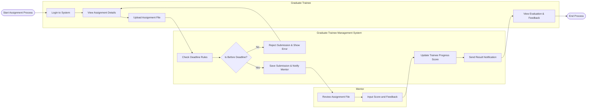

# Swimlane Diagram — Graduate Trainee Management System

## Mermaid Code

## Flow Description | Mo ta luong

| Lane | Actor | Role in Flow |
|------|-------|-------------|
| 1 | Graduate Trainee | Doc de bai, hoan thanh va nop file bai tap, sau do nhan diem va phan hoi. |
| 2 | Graduate Trainee Management System | Kiem soat thoi gian nop bai, luu tru du lieu, tinh toan diem va gui thong bao cac ben. |
| 3 | Mentor | Nhan duoc thong bao co bai moi, vao xem xet cham diem va de lai nhan xet cho thuc tap sinh. |
