# Action Tree — Graduate Trainee Management System

## Mermaid Code

```mermaid
%%{init: {'theme': 'default'}}%%
graph TD
    Root["Graduate Trainee Management System"]

    Root --> M1["Trainee Management"]
    Root --> M2["Program & Batch Management"]
    Root --> M3["Assignment & Evaluation"]
    Root --> M4["Progress Tracking & Reporting"]
    Root --> M5["System Administration"]

    M1 --> A11["Onboard New Trainee"]
    M1 --> A12["Update Trainee Profile"]
    M1 --> A13["Assign Mentor to Trainee"]
    M1 --> A14["Offboard Trainee"]

    M2 --> A21["Create Training Batch"]
    M2 --> A22["Manage Curriculum Modules"]
    M2 --> A23["Configure Training Schedules"]
    M2 --> A24["Track Batch Status"]

    M3 --> A31["Create Assignments"]
    M3 --> A32["Submit Assignment File"]
    M3 --> A33["Score Submission"]
    M3 --> A34["Provide Feedback"]

    M4 --> A41["View Personal Progress"]
    M4 --> A42["Monitor Overall Batch Progress"]
    M4 --> A43["Generate Completion Reports"]
    M4 --> A44["Issue Digital Certificates"]

    M5 --> A51["Manage User Roles"]
    M5 --> A52["Configure Notification Settings"]
    M5 --> A53["Integrate with Payroll/HRMS"]
    M5 --> A54["Review System Logs"]
```

## Module Description | Mo ta Module

| # | Module | Description | Actions |
|---|--------|-------------|---------|
| 1 | Trainee Management | Quan ly thong tin ho so va hoat dong cua thuc tap sinh | Onboard New Trainee, Update Trainee Profile, Assign Mentor to Trainee, Offboard Trainee |
| 2 | Program & Batch Management | Quan ly cac dot dao tao, lich trinh va chuong trinh hoc | Create Training Batch, Manage Curriculum Modules, Configure Training Schedules, Track Batch Status |
| 3 | Assignment & Evaluation | Quan ly viec giao bai tap, nop bai va cham diem | Create Assignments, Submit Assignment File, Score Submission, Provide Feedback |
| 4 | Progress Tracking & Reporting | Theo doi va xuat bao cao ket qua cua thuc tap sinh | View Personal Progress, Monitor Overall Batch Progress, Generate Completion Reports, Issue Digital Certificates |
| 5 | System Administration | Quan tri va thiet lap cau hinh he thong, nguoi dung | Manage User Roles, Configure Notification Settings, Integrate with Payroll/HRMS, Review System Logs |
