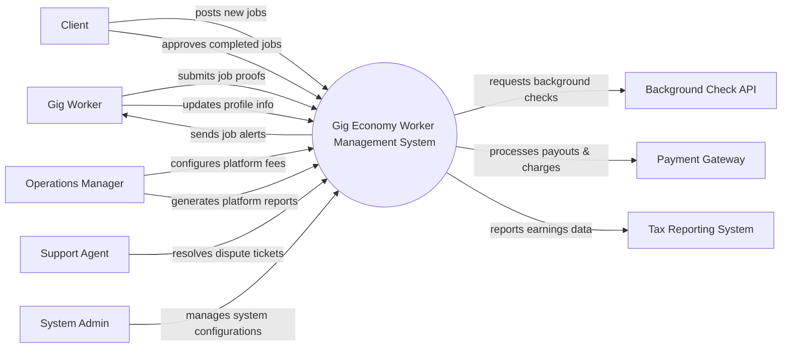

# Context Diagram — Gig Economy Worker Management System

## Mermaid Code

## Actor & Interaction Table | Bang Actor & Tuong tac

| # | Actor | Actor Type | Data Sent TO System | Data Received FROM System | Notes |
|---|-------|------------|---------------------|---------------------------|-------|
| 1 | Gig Worker | Primary | Job completion proofs, profile updates | Job alerts, payment receipts | Nguoi lao dong tu do |
| 2 | Client | Primary | Job details, payment approvals | Job status updates, invoices | Khach hang thue dich vu |
| 3 | Operations Manager | Primary | Fee settings, operational parameters | Platform performance reports | Quan ly van hanh |
| 4 | Support Agent | Primary | Dispute resolutions, ticket updates | Dispute tickets, user complaints | Nhan vien ho tro |
| 5 | Payment Gateway | Supporting | Payment statuses, transaction IDs | Charge requests, payout commands | Cong thanh toan |
| 6 | Background Check API | Supporting | Verification results | Worker identifying details | He thong kiem tra ly lich |
| 7 | Tax Reporting System | Regulatory | Tax compliance updates | Worker earnings reports | He thong bao cao thue |
| 8 | System Admin | Primary | System settings, access roles | Audit logs, system alerts | Quan tri he thong |

## System Boundary Description | Mo ta Pham vi He thong

The Gig Economy Worker Management System is the central platform that connects clients with independent gig workers. It handles job posting, assignment, status tracking, and initiates payments upon job completion. The system does not directly process financial transactions or perform background checks; it integrates with external Payment Gateways and Background Check APIs for these functions. System Admins ensure overall system health and manage user roles.
