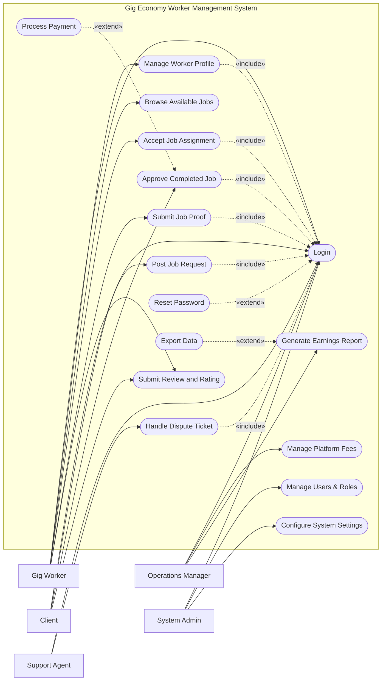

# Use Case Diagram — Gig Economy Worker Management System

## Mermaid Code

## Actor Table | Bang Actor

| # | Actor | Actor Type | Role Description | Related Use Cases |
|---|-------|------------|------------------|-------------------|
| 1 | Gig Worker | Primary | Nguoi lao dong thuc hien cong viec | UC01, UC02, UC04, UC05, UC06, UC09 |
| 2 | Client | Primary | Khach hang dang tai va thue cong viec | UC01, UC03, UC07, UC09 |
| 3 | Operations Manager | Primary | Quan ly van hanh va phi dich vu | UC01, UC11, UC12 |
| 4 | Support Agent | Primary | Giai quyet khieu nai va tranh chap | UC01, UC10 |
| 5 | System Admin | Primary | Quan tri vien he thong | UC01, UC15, UC16 |

## Use Case Table | Bang Use Case

| # | UC ID | Use Case Name | Primary Actor | Secondary Actor | Description | Priority |
|---|-------|---------------|---------------|-----------------|-------------|----------|
| 1 | UC01 | Login | Gig Worker | | Authenticate user access | High |
| 2 | UC02 | Manage Worker Profile | Gig Worker | | Update skills and personal info | Medium |
| 3 | UC03 | Post Job Request | Client | | Create a new job listing | High |
| 4 | UC04 | Browse Available Jobs | Gig Worker | | Search for open job opportunities | High |
| 5 | UC05 | Accept Job Assignment | Gig Worker | | Take on a specific job | High |
| 6 | UC06 | Submit Job Proof | Gig Worker | | Upload evidence of completed work | High |
| 7 | UC07 | Approve Completed Job | Client | | Verify and approve worker's submission | High |
| 8 | UC08 | Process Payment | System | Payment Gateway | Trigger funds transfer to worker | High |
| 9 | UC09 | Submit Review and Rating | Client | | Rate the worker's performance | Medium |
| 10| UC10 | Handle Dispute Ticket | Support Agent | | Resolve conflicts between worker and client | High |
| 11| UC11 | Manage Platform Fees | Operations Manager| | Configure commission rates | Medium |
| 12| UC12 | Generate Earnings Report| Operations Manager| | Create reports on platform revenue | Medium |
| 13| UC13 | Reset Password | Gig Worker | | Recover account access | High |
| 14| UC14 | Export Data | Operations Manager| | Download reports as files | Low |
| 15| UC15 | Manage Users & Roles | System Admin | | Create or deactivate accounts | High |
| 16| UC16 | Configure System Settings | System Admin | | Update system-wide configurations | Medium |

## Use Case Specification | Dac ta Use Case

---

### UC01 — Login

| Field | Detail |
|-------|--------|
| **UC ID** | UC01 |
| **Use Case Name** | Login |
| **Actor(s)** | Primary: Gig Worker, Client, Operations Manager, Support Agent, System Admin |
| **Description** | Cho phep nguoi dung xac thuc de dang nhap vao he thong. |
| **Precondition** | 1. Nguoi dung phai co tai khoan hop le tren he thong.  2. He thong dang hoat dong binh thuong. |
| **Main Flow** | 1. Actor mo trang dang nhap.  2. System hien thi form dang nhap.  3. Actor nhap username va password.  4. Actor nhan nut Submit.  5. System xac thuc thong tin.  6. System chuyen huong den trang chu tuong ung quyen han. |
| **Alternative Flow** | **AF1** — Quen mat khau: Neu Actor chon "Forgot Password", System kich hoat UC13 Reset Password. |
| **Exception Flow** | **EX1** — Sai thong tin: Neu xac thuc that bai, System hien thi thong bao loi va yeu cau nhap lai.  **EX2** — Tai khoan bi khoa: Neu nhap sai qua 5 lan, System khoa tai khoan va thong bao lien he Admin. |
| **Postcondition** | Nguoi dung duoc dang nhap va phien lam viec duoc khoi tao. |
| **Business Rule** | **BR1**: Mat khau phai duoc ma hoa.  **BR2**: Phien dang nhap tu dong het han sau 30 phut khong hoat dong. |

---

### UC03 — Post Job Request

| Field | Detail |
|-------|--------|
| **UC ID** | UC03 |
| **Use Case Name** | Post Job Request |
| **Actor(s)** | Primary: Client |
| **Description** | Cho phep Client tao va dang tai mot cong viec moi len he thong. |
| **Precondition** | 1. Client da dang nhap (Include UC01).  2. Client co phuong thuc thanh toan hop le. |
| **Main Flow** | 1. Actor chon chuc nang "Post Job".  2. System hien thi form tao cong viec.  3. Actor nhap tieu de, mo ta, ngan sach va thoi han.  4. Actor nhan "Submit Job".  5. System xac thuc thong tin nhap vao.  6. System luu cong viec va hien thi tren danh sach viec lam. |
| **Alternative Flow** | **AF1** — Luu nhap: Truoc buoc 4, Actor chon "Save Draft", System luu cong viec o trang thai ban nhap ma khong cong khai. |
| **Exception Flow** | **EX1** — Thieu thong tin: Neu thieu truong bat buoc, System canh bao va chan Submit.  **EX2** — Ngan sach khong hop le: Neu ngan sach duoi muc toi thieu, System bao loi. |
| **Postcondition** | Cong viec duoc luu voi trang thai "Open" va co the duoc tim thay boi Gig Worker. |
| **Business Rule** | **BR1**: Ngan sach cong viec phai lon hon muc toi thieu cua nen tang.  **BR2**: Thoi han phai la mot thoi diem trong tuong lai. |

---

### UC05 — Accept Job Assignment

| Field | Detail |
|-------|--------|
| **UC ID** | UC05 |
| **Use Case Name** | Accept Job Assignment |
| **Actor(s)** | Primary: Gig Worker |
| **Description** | Cho phep Gig Worker nhan mot cong viec dang mo. |
| **Precondition** | 1. Gig Worker da dang nhap (Include UC01).  2. Cong viec phai o trang thai "Open". |
| **Main Flow** | 1. Actor xem chi tiet mot cong viec.  2. Actor nhan "Accept Job".  3. System kiem tra dieu kien cua Worker (vi du: chua vuot qua gioi han cong viec cung luc).  4. System cap nhat trang thai cong viec thanh "In Progress".  5. System gan cong viec cho Worker va thong bao cho Client. |
| **Alternative Flow** | **AF1** — Huy nhan viec: Sau khi nhan viec, trong vong 15 phut dau, Actor co the chon "Cancel Assignment" de tra lai trang thai "Open". |
| **Exception Flow** | **EX1** — Cong viec da bi nhan: Neu cong viec vua bi nguoi khac nhan, System thong bao "Job no longer available". |
| **Postcondition** | Cong viec duoc chuyen sang "In Progress" va thuoc ve Gig Worker da nhan. |
| **Business Rule** | **BR1**: Mot Worker khong the nhan qua 3 cong viec cung luc.  **BR2**: Tai khoan Worker phai da qua kiem tra ly lich (Background Check). |

---

### UC06 — Submit Job Proof

| Field | Detail |
|-------|--------|
| **UC ID** | UC06 |
| **Use Case Name** | Submit Job Proof |
| **Actor(s)** | Primary: Gig Worker |
| **Description** | Gig Worker nop bang chung hoan thanh cong viec de Client nghiem thu. |
| **Precondition** | 1. Gig Worker da dang nhap (Include UC01).  2. Cong viec dang o trang thai "In Progress". |
| **Main Flow** | 1. Actor vao danh sach cong viec dang lam va chon "Submit Work".  2. System hien thi form tai len bang chung.  3. Actor tai len hinh anh, tai lieu va ghi chu hoan thanh.  4. Actor nhan nut "Submit".  5. System luu lai du lieu.  6. System cap nhat trang thai thanh "In Review" va thong bao cho Client. |
| **Alternative Flow** | **AF1** — Luu tam thoi: Actor the tai len file nhung chua nhan "Submit", System luu tru du lieu tam thoi. |
| **Exception Flow** | **EX1** — File qua lon: Neu file tai len vuot qua dung luong cho phep, System bao loi "File size exceeded". |
| **Postcondition** | Cong viec chuyen sang trang thai "In Review", cho Client phe duyet. |
| **Business Rule** | **BR1**: Phai co it nhat mot file hoac URL duoc cung cap lam bang chung.  **BR2**: Khong duoc nop qua thoi han (Deadline) tru khi co su dong y cua Client. |

---

### UC07 — Approve Completed Job

| Field | Detail |
|-------|--------|
| **UC ID** | UC07 |
| **Use Case Name** | Approve Completed Job |
| **Actor(s)** | Primary: Client |
| **Description** | Client xem xet va phe duyet cong viec da duoc Gig Worker nop. |
| **Precondition** | 1. Client da dang nhap (Include UC01).  2. Cong viec dang o trang thai "In Review". |
| **Main Flow** | 1. Actor mo cong viec can xem xet.  2. System hien thi bang chung va ghi chu tu Worker.  3. Actor kiem tra va nhan "Approve".  4. System cap nhat trang thai cong viec thanh "Completed".  5. System kich hoat luong thanh toan (Extend UC08) va thong bao cho Worker. |
| **Alternative Flow** | **AF1** — Yeu cau sua doi: Neu khong hai long, Actor chon "Request Revision", nhap ly do. System doi trang thai thanh "Revision Requested". |
| **Exception Flow** | **EX1** — Tranh chap: Neu sau nhieu lan sua doi khong dat, Actor chon "Open Dispute". System doi trang thai thanh "Disputed" va kich hoat Support Agent. |
| **Postcondition** | Cong viec duoc hoan thanh va tien trinh thanh toan duoc bat dau. |
| **Business Rule** | **BR1**: Sau 3 ngay neu Client khong co phan hoi, he thong tu dong Approve cong viec.  **BR2**: Client co the yeu cau sua doi toi da 2 lan truoc khi phai mo tranh chap. |
