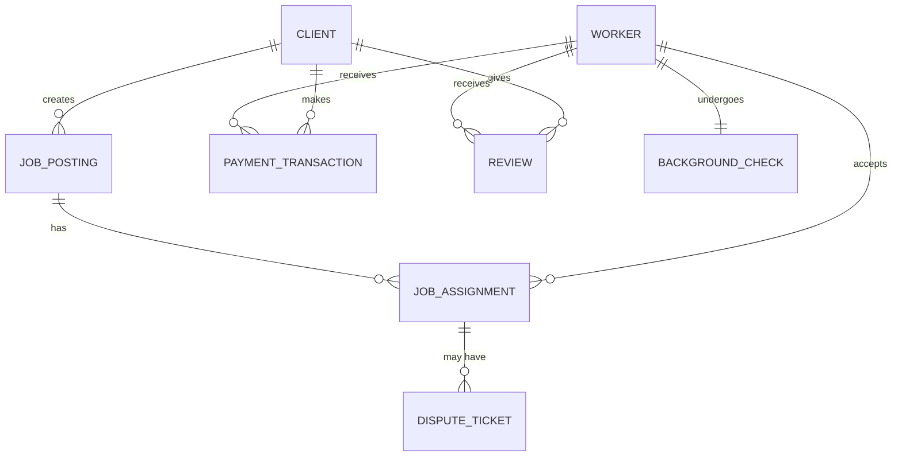

# Conceptual ERD — Gig Economy Worker Management System

## Mermaid Code

## Entity Description Table | Bang mo ta Entity

| # | Entity Name | Vietnamese Name | Description | Key Attributes | Main Relationships |
|---|-------------|-----------------|-------------|----------------|-------------------|
| 1 | CLIENT | Khach hang | Thong tin nguoi thue cong viec | client_id, name, company | creates JOB_POSTING |
| 2 | WORKER | Nguoi lao dong | Ho so cua gig worker | worker_id, name, skills | accepts JOB_ASSIGNMENT |
| 3 | JOB_POSTING | Bai dang viec | Thong tin cong viec duoc dang | job_id, title, budget | has JOB_ASSIGNMENT |
| 4 | JOB_ASSIGNMENT | Giao viec | Phien ban thuc thi cua cong viec | assignment_id, status | belongs to JOB_POSTING |
| 5 | PAYMENT_TRANSACTION | Giao dich thanh toan | Ban ghi ve viec chuyen tien | payment_id, amount, date | belongs to WORKER |
| 6 | REVIEW | Danh gia | Danh gia tu khach hang cho worker | review_id, rating, comment | belongs to WORKER |
| 7 | DISPUTE_TICKET | Phieu khieu nai | Yeu cau giai quyet tranh chap | ticket_id, issue, status | belongs to JOB_ASSIGNMENT |
| 8 | BACKGROUND_CHECK | Kiem tra ly lich | Ho so xac minh danh tinh worker | check_id, status, result | belongs to WORKER |

## Relationship Description | Mo ta Quan he

| # | From Entity | Cardinality | To Entity | Relationship Label | Business Explanation |
|---|-------------|-------------|-----------|-------------------|----------------------|
| 1 | CLIENT | one-to-many | JOB_POSTING | creates | Mot khach hang co the tao nhieu bai dang viec. |
| 2 | CLIENT | one-to-many | PAYMENT_TRANSACTION | makes | Mot khach hang co the thuc hien nhieu giao dich thanh toan. |
| 3 | CLIENT | one-to-many | REVIEW | gives | Mot khach hang co the de lai nhieu danh gia. |
| 4 | WORKER | one-to-many | JOB_ASSIGNMENT | accepts | Mot worker co the nhan nhieu cong viec. |
| 5 | WORKER | one-to-many | PAYMENT_TRANSACTION | receives | Mot worker co the nhan nhieu khoan thanh toan. |
| 6 | WORKER | one-to-many | REVIEW | receives | Mot worker co the nhan nhieu danh gia tu khach hang. |
| 7 | WORKER | one-to-one | BACKGROUND_CHECK | undergoes | Mot worker chi co mot ho so xac minh ly lich tren he thong. |
| 8 | JOB_POSTING | one-to-many | JOB_ASSIGNMENT | has | Mot bai dang viec co the duoc phan bo thanh nhieu nhiem vu (giao viec). |
| 9 | JOB_ASSIGNMENT | one-to-many | DISPUTE_TICKET | may have | Mot cong viec duoc giao co the phat sinh nhieu khieu nai neu co van de. |
