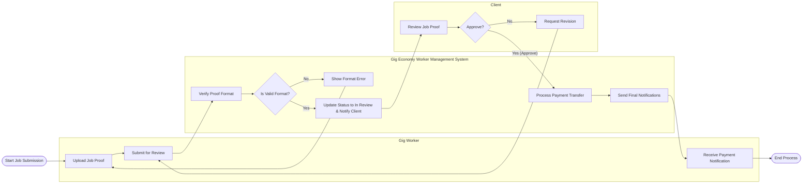

# Swimlane Diagram — Gig Economy Worker Management System

## Mermaid Code

## Flow Description | Mo ta luong

| Lane | Actor | Role in Flow |
|------|-------|-------------|
| 1 | Gig Worker | Nguoi thuc hien tai len bang chung hoan thanh cong viec va cho nhan thanh toan. |
| 2 | Gig Economy Worker Management System | He thong kiem tra dinh dang file, dieu phoi trang thai cong viec, xu ly thanh toan va thong bao. |
| 3 | Client | Nguoi kiem tra ket qua cong viec va ra quyet dinh phe duyet hoac yeu cau sua doi. |
