# Action Tree — Gig Economy Worker Management System

## Mermaid Code

```mermaid
%%{init: {'theme': 'default'}}%%
graph TD
    Root["Gig Economy Worker Management System"]

    Root --> M1["User Profile Management"]
    Root --> M2["Job Management"]
    Root --> M3["Financial & Payments"]
    Root --> M4["Reviews & Ratings"]
    Root --> M5["Support & Admin"]

    M1 --> A11["Register Account"]
    M1 --> A12["Update Worker Skills"]
    M1 --> A13["Submit Background Check"]
    M1 --> A14["Verify Identity"]

    M2 --> A21["Post New Job"]
    M2 --> A22["Browse Open Jobs"]
    M2 --> A23["Accept Job"]
    M2 --> A24["Submit Work Proof"]
    M2 --> A25["Approve/Reject Work"]

    M3 --> A31["Configure Platform Fees"]
    M3 --> A32["Process Payouts"]
    M3 --> A33["Generate Invoices"]
    M3 --> A34["View Earnings Reports"]

    M4 --> A41["Rate Worker"]
    M4 --> A42["Rate Client"]
    M4 --> A43["View Profile Ratings"]

    M5 --> A51["Open Dispute Ticket"]
    M5 --> A52["Resolve Dispute"]
    M5 --> A53["Manage User Roles"]
    M5 --> A54["Configure System Settings"]
```

## Module Description | Mo ta Module

| # | Module | Description | Actions |
|---|--------|-------------|---------|
| 1 | User Profile Management | Quan ly ho so ca nhan, ky nang va xac minh ly lich | Register Account, Update Worker Skills, Submit Background Check, Verify Identity |
| 2 | Job Management | Quan ly toan bo vong doi cua mot cong viec | Post New Job, Browse Open Jobs, Accept Job, Submit Work Proof, Approve/Reject Work |
| 3 | Financial & Payments | Quan ly cac giao dich, thanh toan va phi dich vu | Configure Platform Fees, Process Payouts, Generate Invoices, View Earnings Reports |
| 4 | Reviews & Ratings | He thong danh gia va xep hang sau cong viec | Rate Worker, Rate Client, View Profile Ratings |
| 5 | Support & Admin | Ho tro khieu nai va quan tri he thong | Open Dispute Ticket, Resolve Dispute, Manage User Roles, Configure System Settings |
