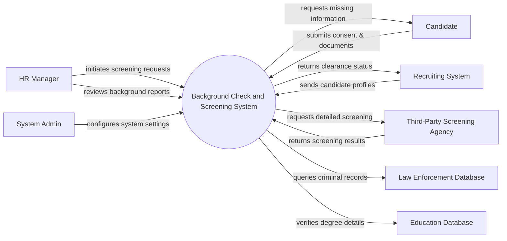

# Context Diagram — Background Check and Screening System

## Mermaid Code

## Actor & Interaction Table | Bang Actor & Tuong tac

| # | Actor | Actor Type | Data Sent TO System | Data Received FROM System | Notes |
|---|-------|------------|---------------------|---------------------------|-------|
| 1 | HR Manager | Primary | Screening requests, clearance decisions | Background reports, alerts | Nguoi quan ly nhan su the hien yeu cau kiem tra |
| 2 | Candidate | Primary | Consent forms, identity documents | Requests for missing information | Ung vien can duoc kiem tra thong tin |
| 3 | System Admin | Primary | System settings, user roles, policies | System logs, audit reports | Quan tri he thong |
| 4 | Recruiting System | Supporting | Candidate profiles, job details | Final clearance status | He thong tuyen dung noi bo |
| 5 | Third-Party Screening Agency | Supporting | External screening results | Detailed screening requests | Ben thu ba cung cap dich vu kiem tra |
| 6 | Law Enforcement Database | Regulatory | Criminal records matching data | Query for criminal records | Co so du lieu ho so phap ly |
| 7 | Education Database | Supporting | Verification of degrees | Query for education records | Co so du lieu truong hoc |

## System Boundary Description | Mo ta Pham vi He thong

The Background Check and Screening System is responsible for managing the background verification processes for candidates. It handles consent gathering, document collection, and interacts with external agencies and databases to verify criminal, educational, and employment history. The system compiles these findings into comprehensive reports for HR Managers to review. It does not perform internal ATS (Applicant Tracking System) functions, but rather integrates with external recruiting systems to receive candidate profiles and return the final screening decisions.
