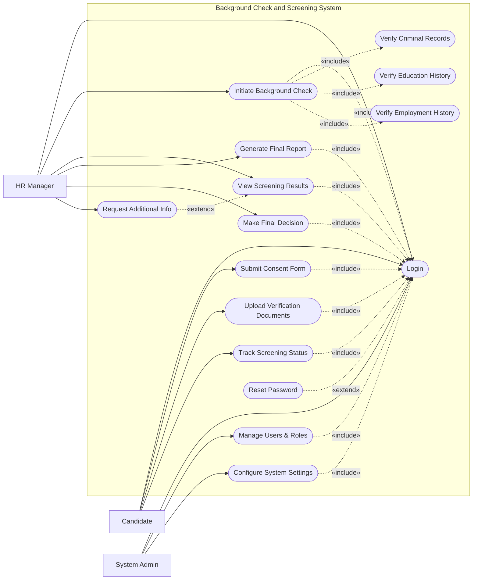

# Use Case Diagram — Background Check and Screening System

## Mermaid Code

## Actor Table | Bang Actor

| # | Actor | Actor Type | Role Description | Related Use Cases |
|---|-------|------------|------------------|-------------------|
| 1 | Candidate | Primary | Ung vien can duoc kiem tra ly lich va nop ho so | UC01, UC02, UC03, UC04 |
| 2 | HR Manager | Primary | Nguoi quan ly nhan su yeu cau va danh gia ket qua kiem tra | UC01, UC05, UC06, UC10, UC11, UC12 |
| 3 | System Admin | Primary | Quan tri vien he thong cai dat va quan ly quyen | UC01, UC13, UC14 |

## Use Case Table | Bang Use Case

| # | UC ID | Use Case Name | Primary Actor | Secondary Actor | Description | Priority |
|---|-------|---------------|---------------|-----------------|-------------|----------|
| 1 | UC01 | Login | Candidate | | Authenticate user access | High |
| 2 | UC02 | Submit Consent Form | Candidate | | Provide legal consent for background checks | High |
| 3 | UC03 | Upload Verification Documents | Candidate | | Upload IDs and relevant documents | High |
| 4 | UC04 | Track Screening Status | Candidate | | Check current progress of their screening | Medium |
| 5 | UC05 | Initiate Background Check | HR Manager | | Start the background screening process | High |
| 6 | UC06 | View Screening Results | HR Manager | | Review partial or complete check results | High |
| 7 | UC07 | Verify Criminal Records | System | Law Database | Automatically check criminal history | High |
| 8 | UC08 | Verify Education History | System | Edu Database | Automatically verify degree details | High |
| 9 | UC09 | Verify Employment History | System | Screening Agency | Check past employments | High |
| 10| UC10 | Generate Final Report | HR Manager | | Compile all findings into a single report | High |
| 11| UC11 | Make Final Decision | HR Manager | | Clear or reject the candidate | High |
| 12| UC12 | Request Additional Info | HR Manager | | Ask candidate for more documents if needed | Medium |
| 13| UC13 | Manage Users & Roles | System Admin | | Manage system accounts and permissions | High |
| 14| UC14 | Configure System Settings | System Admin | | Setup integration APIs and screening rules | Medium |
| 15| UC15 | Reset Password | Candidate | | Recover forgotten passwords | High |

## Use Case Specification | Dac ta Use Case

---

### UC01 — Login

| Field | Detail |
|-------|--------|
| **UC ID** | UC01 |
| **Use Case Name** | Login |
| **Actor(s)** | Primary: Candidate, HR Manager, System Admin |
| **Description** | Cho phep nguoi dung xac thuc de dang nhap vao he thong. |
| **Precondition** | 1. Nguoi dung da co thong tin tai khoan tren he thong.  2. He thong dang hoat dong. |
| **Main Flow** | 1. Actor mo trang dang nhap.  2. System hien thi form dang nhap.  3. Actor nhap username va password.  4. Actor nhan nut Submit.  5. System xac thuc thong tin voi co so du lieu.  6. System chuyen huong den bang dieu khien tuong ung voi vai tro cua nguoi dung. |
| **Alternative Flow** | **AF1** — Quen mat khau: Neu Actor chon "Forgot Password", System kich hoat UC15 Reset Password. |
| **Exception Flow** | **EX1** — Sai thong tin: Neu xac thuc that bai, System hien thi thong bao loi va yeu cau nhap lai.  **EX2** — Tai khoan bi khoa: Neu nhap sai qua 5 lan, System khoa tai khoan va thong bao. |
| **Postcondition** | Nguoi dung dang nhap thanh cong va bat dau phien lam viec. |
| **Business Rule** | **BR1**: Mat khau phai duoc ma hoa an toan.  **BR2**: Phien lam viec se tu dong het han sau 30 phut khong hoat dong. |

---

### UC02 — Submit Consent Form

| Field | Detail |
|-------|--------|
| **UC ID** | UC02 |
| **Use Case Name** | Submit Consent Form |
| **Actor(s)** | Primary: Candidate |
| **Description** | Cho phep ung vien ky va nop bieu mau dong y khao sat ly lich. |
| **Precondition** | 1. Ung vien da dang nhap (Include UC01).  2. Ho so ung vien chua co bieu mau dong y. |
| **Main Flow** | 1. Actor chon "Pending Actions" va nhan vao "Consent Form".  2. System hien thi bieu mau dong y khao sat phap ly.  3. Actor doc ky va tich chon vao cac dieu khoan dong y.  4. Actor ky ten dien tu va nhan Submit.  5. System xac nhan bieu mau da duoc ky va luu vao ho so.  6. System chuyen trang thai ho so thanh "Consent Received". |
| **Alternative Flow** | **AF1** — Huy tac vu: Truoc khi Submit, Actor chon "Cancel", System se quay lai trang truoc va khong luu thay doi. |
| **Exception Flow** | **EX1** — Thieu thong tin: Neu Actor khong tich chon du cac dieu khoan, System bao loi va khong cho phep Submit. |
| **Postcondition** | He thong nhan duoc su dong y tu ung vien, cho phep bat dau cac buoc kiem tra ly lich. |
| **Business Rule** | **BR1**: Bieu mau phai co hieu luc phap ly the hien su dong y cua ung vien.  **BR2**: Khong co kiem tra ly lich nao duoc thuc hien neu chua co Consent Form. |

---

### UC05 — Initiate Background Check

| Field | Detail |
|-------|--------|
| **UC ID** | UC05 |
| **Use Case Name** | Initiate Background Check |
| **Actor(s)** | Primary: HR Manager |
| **Description** | HR Manager bat dau quy trinh kiem tra ly lich tu dong hoac thu cong. |
| **Precondition** | 1. HR Manager da dang nhap (Include UC01).  2. Ung vien da hoan thanh Submit Consent Form (UC02). |
| **Main Flow** | 1. Actor chon mot ung vien trong danh sach "Ready for Screening".  2. System hien thi thong tin ung vien va cac goi kiem tra tuong ung.  3. Actor chon cac loai kiem tra (Criminal, Education, Employment).  4. Actor nhan "Start Screening".  5. System kich hoat cac quy trinh tuong ung (Include UC07, UC08, UC09).  6. System cap nhat trang thai ho so la "In Progress". |
| **Alternative Flow** | **AF1** — Chon lai goi: Actor co the thay doi loai kiem tra (vi du bo qua Employment) truoc khi nhan Start Screening. |
| **Exception Flow** | **EX1** — Thieu bieu mau dong y: Neu he thong phat hien chua co Consent, System chan hanh dong va hien thi canh bao loi. |
| **Postcondition** | He thong bat dau gui cac yeu cau xac minh va cho ket qua tu cac ben thu ba. |
| **Business Rule** | **BR1**: Cac loai kiem tra phu thuoc vao vi tri va yeu cau cong viec cua ung vien.  **BR2**: He thong tu dong ghi nhat ky thoi gian bat dau kiem tra. |

---

### UC06 — View Screening Results

| Field | Detail |
|-------|--------|
| **UC ID** | UC06 |
| **Use Case Name** | View Screening Results |
| **Actor(s)** | Primary: HR Manager |
| **Description** | HR Manager xem ket qua chi tiet cua tung hang muc kiem tra ly lich. |
| **Precondition** | 1. HR Manager da dang nhap (Include UC01).  2. Ho so khao sat phai o trang thai "In Progress" hoac "Completed". |
| **Main Flow** | 1. Actor chon ho so ung vien tu danh sach "Screening Dashboard".  2. System hien thi tong quan cac muc dang kiem tra (Criminal, Education, Employment).  3. Actor nhan vao mot muc de xem ket qua chi tiet.  4. System hien thi du lieu nhan duoc tu he thong tuong ung hoac ben thu ba.  5. Actor danh gia tinh xac thuc cua ket qua. |
| **Alternative Flow** | **AF1** — Yeu cau them thong tin (Extend UC12): Neu ket qua mo ho, Actor co the mo rong de gui yeu cau cung cap them tai lieu tu ung vien. |
| **Exception Flow** | **EX1** — Loi ket noi: Neu ket qua tu ben thu ba chua tra ve hoac that bai, System hien thi thong bao "Pending API Response" hoac "Verification Failed". |
| **Postcondition** | HR Manager xem duoc toan bo thong tin can thiet de dua ra quyet dinh hoac tao bao cao. |
| **Business Rule** | **BR1**: Ket qua phai duoc bao mat va chi nhung HR Manager duoc phan quyen moi co the xem.  **BR2**: Du lieu hien thi phai di kem voi nguon xac minh ro rang. |

---

### UC10 — Generate Final Report

| Field | Detail |
|-------|--------|
| **UC ID** | UC10 |
| **Use Case Name** | Generate Final Report |
| **Actor(s)** | Primary: HR Manager |
| **Description** | He thong tong hop toan bo ket qua khao sat thanh mot ban bao cao chinh thuc. |
| **Precondition** | 1. Toan bo cac kiem tra da duoc hoan tat.  2. HR Manager da dang nhap. |
| **Main Flow** | 1. Actor chon ung vien tu danh sach ho so hoan tat.  2. Actor nhan nut "Generate Report".  3. System thu thap cac ket qua Criminal, Education, va Employment.  4. System tao ra mot tai lieu PDF chua toan bo thong tin.  5. System luu tai lieu nay vao ho so va cho phep tai xuong.  6. Actor tai ban bao cao va tien hanh danh gia chung cuoc. |
| **Alternative Flow** | **AF1** — In bao cao: Actor co the chon "Print" de in truc tiep tu trinh duyet thay vi tai file PDF. |
| **Exception Flow** | **EX1** — Quy trinh chua hoan tat: Neu co hang muc van dang "Pending", System se canh bao rang bao cao chua day du. |
| **Postcondition** | Ban bao cao cuoi cung duoc tao va luu tru an toan. |
| **Business Rule** | **BR1**: Bao cao phai tuan thu mau tieu chuan cua cong ty va co chu ky/watermark cua he thong. |
