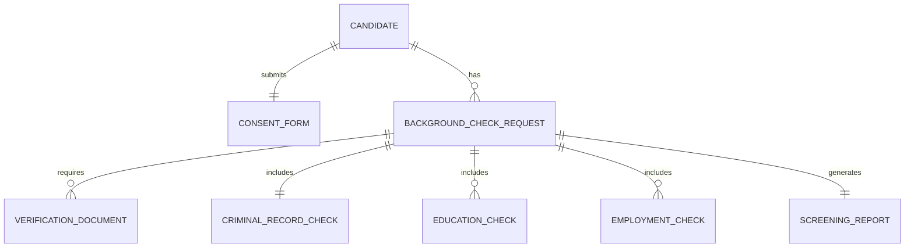

# Conceptual ERD — Background Check and Screening System

## Mermaid Code

## Entity Description Table | Bang mo ta Entity

| # | Entity Name | Vietnamese Name | Description | Key Attributes | Main Relationships |
|---|-------------|-----------------|-------------|----------------|-------------------|
| 1 | CANDIDATE | Ung vien | Thong tin ca nhan cua ung vien | candidate_id, name, email | submits CONSENT_FORM, has BACKGROUND_CHECK_REQUEST |
| 2 | CONSENT_FORM | Bieu mau dong y | Ho so phap ly ung vien ky xac nhan | form_id, signed_date, status | belongs to CANDIDATE |
| 3 | VERIFICATION_DOCUMENT | Tai lieu xac minh | Cac giay to chung minh danh tinh, bang cap | doc_id, type, upload_date | belongs to BACKGROUND_CHECK_REQUEST |
| 4 | BACKGROUND_CHECK_REQUEST| Yeu cau kiem tra | Quy trinh kiem tra ly lich cho mot ung vien | request_id, start_date, status | belongs to CANDIDATE, generates SCREENING_REPORT |
| 5 | CRIMINAL_RECORD_CHECK | Kiem tra an tich | Ket qua tu co so du lieu toi pham phap ly | criminal_id, status, details | belongs to BACKGROUND_CHECK_REQUEST |
| 6 | EDUCATION_CHECK | Kiem tra hoc van | Ket qua xac minh bang cap tu cac truong | edu_id, institution, degree | belongs to BACKGROUND_CHECK_REQUEST |
| 7 | EMPLOYMENT_CHECK | Kiem tra kinh nghiem | Ket qua xac minh tu nha tuyen dung cu | emp_id, company, duration | belongs to BACKGROUND_CHECK_REQUEST |
| 8 | SCREENING_REPORT | Bao cao khao sat | Ban bao cao tong hop cuoi cung | report_id, generated_date, final_status | belongs to BACKGROUND_CHECK_REQUEST |

## Relationship Description | Mo ta Quan he

| # | From Entity | Cardinality | To Entity | Relationship Label | Business Explanation |
|---|-------------|-------------|-----------|-------------------|----------------------|
| 1 | CANDIDATE | one-to-one | CONSENT_FORM | submits | Mot ung vien nop mot bieu mau dong y phap ly. |
| 2 | CANDIDATE | one-to-many | BACKGROUND_CHECK_REQUEST | has | Mot ung vien co the co nhieu yeu cau kiem tra qua thoi gian. |
| 3 | BACKGROUND_CHECK_REQUEST | one-to-many | VERIFICATION_DOCUMENT | requires | Mot yeu cau kiem tra can nhieu tai lieu xac minh. |
| 4 | BACKGROUND_CHECK_REQUEST | one-to-one | CRIMINAL_RECORD_CHECK | includes | Mot yeu cau bao gom mot kiem tra an tich duy nhat. |
| 5 | BACKGROUND_CHECK_REQUEST | one-to-many | EDUCATION_CHECK | includes | Mot yeu cau co the kiem tra nhieu cap bac hoc van. |
| 6 | BACKGROUND_CHECK_REQUEST | one-to-many | EMPLOYMENT_CHECK | includes | Mot yeu cau co the kiem tra nhieu noi lam viec cu. |
| 7 | BACKGROUND_CHECK_REQUEST | one-to-one | SCREENING_REPORT | generates | Moi yeu cau kiem tra sau cung tao ra mot ban bao cao. |
