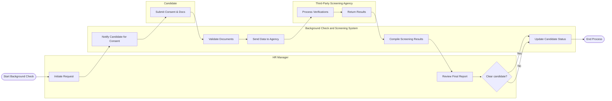

# Swimlane Diagram — Background Check and Screening System

## Mermaid Code

## Flow Description | Mo ta luong

| Lane | Actor | Role in Flow |
|------|-------|-------------|
| 1 | HR Manager | Nguoi bat dau quy trinh kiem tra, doc ket qua tong hop va dua ra quyet dinh cuoi cung. |
| 2 | Background Check and Screening System | He thong dieu pho luong, xac thuc du lieu, ket noi voi ben thu ba va tong hop bao cao. |
| 3 | Candidate | Ung vien nhan thong bao, cung cap su dong y phap ly va nop giay to xac minh. |
| 4 | Third-Party Screening Agency | Ben thu ba tiep nhan yeu cau, thuc hien kiem tra ly lich va tra ket qua ve he thong. |
