# Action Tree — Background Check and Screening System

## Mermaid Code

```mermaid
%%{init: {'theme': 'default'}}%%
graph TD
    Root["Background Check and Screening System"]

    Root --> M1["Profile & Consent Management"]
    Root --> M2["Verification Modules"]
    Root --> M3["Integration & External Checks"]
    Root --> M4["Reporting & Decisions"]
    Root --> M5["System Administration"]

    M1 --> A11["Manage Candidate Profiles"]
    M1 --> A12["Collect Consent Forms"]
    M1 --> A13["Manage Uploaded Documents"]
    M1 --> A14["Track Document Expiration"]

    M2 --> A21["Verify Criminal Records"]
    M2 --> A22["Verify Education History"]
    M2 --> A23["Verify Employment History"]
    M2 --> A24["Verify Identity Data"]

    M3 --> A31["Sync with Recruiting System"]
    M3 --> A32["Send Agency Requests"]
    M3 --> A33["Receive External Results"]

    M4 --> A41["Generate Screening Reports"]
    M4 --> A42["Make Clearance Decisions"]
    M4 --> A43["Track Screening Status"]
    M4 --> A44["Notify Candidate Results"]

    M5 --> A51["Manage Users & Roles"]
    M5 --> A52["Configure Check Policies"]
    M5 --> A53["Audit System Logs"]
    M5 --> A54["Configure Integration APIs"]
```

## Module Description | Mo ta Module

| # | Module | Description | Actions |
|---|--------|-------------|---------|
| 1 | Profile & Consent Management | Quan ly ho so ung vien, thu thap giay dong y va tai lieu ca nhan | Manage Candidate Profiles, Collect Consent Forms, Manage Uploaded Documents, Track Document Expiration |
| 2 | Verification Modules | Thuc hien kiem tra cac hang muc thong tin ung vien cung cap | Verify Criminal Records, Verify Education History, Verify Employment History, Verify Identity Data |
| 3 | Integration & External Checks | Giao tiep voi ATS va cac ben cung cap dich vu khao sat thu ba | Sync with Recruiting System, Send Agency Requests, Receive External Results |
| 4 | Reporting & Decisions | Tong hop ket qua, xuat bao cao va luu tru quyet dinh tuyen dung | Generate Screening Reports, Make Clearance Decisions, Track Screening Status, Notify Candidate Results |
| 5 | System Administration | Quan tri he thong, phan quyen va thiet lap cau hinh API | Manage Users & Roles, Configure Check Policies, Audit System Logs, Configure Integration APIs |
