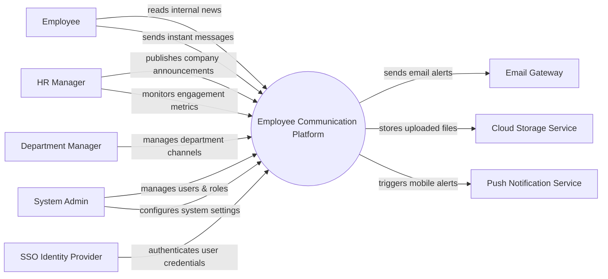

# Context Diagram — Employee Communication Platform

## Mermaid Code

## Actor & Interaction Table | Bang Actor & Tuong tac

| # | Actor | Actor Type | Data Sent TO System | Data Received FROM System | Notes |
|---|-------|------------|---------------------|---------------------------|-------|
| 1 | Employee | Primary | Messages, file uploads, poll votes | Announcements, message replies | Nhan vien thong thuong su dung nen tang |
| 2 | HR Manager | Primary | Company announcements, engagement queries | Engagement reports, usage metrics | Quan ly nhan su, nguoi dang tin tuc |
| 3 | Department Manager | Primary | Channel configurations, department messages | Channel activity logs | Quan ly cac kenh thuoc phong ban |
| 4 | System Admin | Primary | System configurations, user role assignments | System logs, error reports | Quan tri he thong |
| 5 | SSO Identity Provider | Supporting | Authentication tokens, user identities | Login requests | He thong SSO xac thuc |
| 6 | Email Gateway | Supporting | Email delivery statuses | Email content, recipient addresses | Cong gui email thong bao |
| 7 | Cloud Storage Service | Supporting | File download links | Uploaded files, documents | Dich vu luu tru dam may |
| 8 | Push Notification Service | Supporting | Push delivery receipts | Push notification payloads | Dich vu day thong bao mobile |

## System Boundary Description | Mo ta Pham vi He thong

The Employee Communication Platform is a centralized hub designed to facilitate internal corporate communication. It handles real-time messaging, company announcements, file sharing, and team collaboration. The system does not directly store massive files or manage core employee HR records; instead, it relies on Cloud Storage Services for heavy files and SSO Identity Providers for user authentication. It also utilizes external Email Gateways and Push Notification Services to deliver immediate alerts to users.
