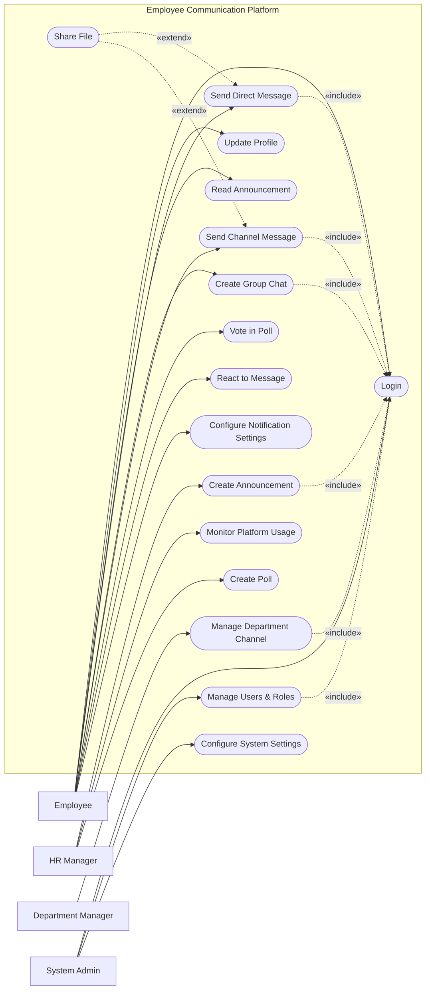

# Use Case Diagram — Employee Communication Platform

## Mermaid Code

## Actor Table | Bang Actor

| # | Actor | Actor Type | Role Description | Related Use Cases |
|---|-------|------------|------------------|-------------------|
| 1 | Employee | Primary | Nhan vien trong cong ty su dung de lien lac | UC01, UC02, UC03, UC04, UC05, UC06, UC09, UC10, UC11 |
| 2 | HR Manager | Primary | Nhan su truyen thong noi bo | UC08, UC12, UC13 |
| 3 | Department Manager | Primary | Truong cac phong ban quan ly kenh rieng | UC14 |
| 4 | System Admin | Primary | Quan tri vien he thong | UC01, UC15, UC16 |

## Use Case Table | Bang Use Case

| # | UC ID | Use Case Name | Primary Actor | Secondary Actor | Description | Priority |
|---|-------|---------------|---------------|-----------------|-------------|----------|
| 1 | UC01 | Login | Employee | SSO Provider | Xac thuc dang nhap vao nen tang | High |
| 2 | UC02 | Update Profile | Employee | | Cap nhat thong tin ca nhan, avatar | Low |
| 3 | UC03 | Read Announcement | Employee | | Xem cac thong bao tu cong ty | High |
| 4 | UC04 | Send Direct Message | Employee | | Gui tin nhan ca nhan 1-1 | High |
| 5 | UC05 | Create Group Chat | Employee | | Tao nhom chat rieng tu | Medium |
| 6 | UC06 | Send Channel Message | Employee | | Gui tin nhan vao kenh chung | High |
| 7 | UC07 | Share File | Employee | Cloud Storage | Tai va chia se tai lieu | High |
| 8 | UC08 | Create Poll | HR Manager | | Tao cuoc binh chon tren nen tang | Medium |
| 9 | UC09 | Vote in Poll | Employee | | Tham gia khao sat, binh chon | Medium |
| 10| UC10 | React to Message | Employee | | Tha cam xuc vao tin nhan | Low |
| 11| UC11 | Configure Notification Settings | Employee | | Tuy chinh thong bao | Medium |
| 12| UC12 | Create Announcement | HR Manager | | Dang thong bao toan cong ty | High |
| 13| UC13 | Monitor Platform Usage | HR Manager | | Xem thong ke tuong tac | Medium |
| 14| UC14 | Manage Department Channel | Department Manager| | Quan ly thanh vien kenh phong ban | High |
| 15| UC15 | Manage Users & Roles | System Admin | | Quan ly tai khoan va quyen | High |
| 16| UC16 | Configure System Settings | System Admin | | Cai dat thong so he thong | High |

## Use Case Specification | Dac ta Use Case

---

### UC01 — Login

| Field | Detail |
|-------|--------|
| **UC ID** | UC01 |
| **Use Case Name** | Login |
| **Actor(s)** | Primary: Employee, HR Manager, Department Manager, System Admin / Secondary: SSO Provider |
| **Description** | Cho phep nguoi dung dang nhap vao nen tang thong qua he thong SSO cua cong ty. |
| **Precondition** | 1. Tai khoan da duoc tao tren he thong Active Directory.  2. He thong mang on dinh. |
| **Main Flow** | 1. Actor mo ung dung/web.  2. System chuyen huong den trang dang nhap SSO.  3. Actor nhap thong tin tai khoan SSO.  4. SSO xac thuc va tra ve token cho System.  5. System kiem tra quyen va cho phep vao trang chu. |
| **Alternative Flow** | **AF1** — Dang nhap bang email: Neu SSO loi, Actor co the chon dang nhap truc tiep bang email cong ty duoc cung cap. |
| **Exception Flow** | **EX1** — Sai mat khau: SSO tra ve loi, System hien thi thong bao sai thong tin dang nhap.  **EX2** — Tai khoan bi vo hieu: Nhan vien da nghi viec bi khoa tai khoan, System hien thi loi "Account deactivated". |
| **Postcondition** | Nguoi dung duoc cap quyen truy cap vao he thong tuong ung role. |
| **Business Rule** | **BR1**: Phai dung email domain cua cong ty de dang nhap.  **BR2**: Phien lam viec tu dong dong sau 24h. |

---

### UC04 — Send Direct Message

| Field | Detail |
|-------|--------|
| **UC ID** | UC04 |
| **Use Case Name** | Send Direct Message |
| **Actor(s)** | Primary: Employee |
| **Description** | Nhan vien gui tin nhan 1-1 cho dong nghiep khac. |
| **Precondition** | 1. Da dang nhap vao he thong.  2. Nguoi nhan ton tai tren he thong. |
| **Main Flow** | 1. Actor chon mot lien he tu danh ba hien thi tren he thong.  2. System mo cua so chat voi nguoi do.  3. Actor nhap noi dung tin nhan va nhan gui.  4. System luu tin nhan vao database.  5. System hien thi tin nhan tren man hinh hien tai va day den nguoi nhan. |
| **Alternative Flow** | **AF1** — Dinh kem file: Truoc khi gui, Actor co the chon "Attach File", he thong kich hoat UC07 Share File. |
| **Exception Flow** | **EX1** — Nguoi nhan bi chan: Neu nguoi nhan bi khoa account, System bao "User is currently unavailable".  **EX2** — Loi mang: System khong the gui tin nhan, hien thi icon "Retry" ben canh tin nhan. |
| **Postcondition** | Tin nhan duoc hien thi trong khung chat cua ca hai nguoi. |
| **Business Rule** | **BR1**: Tin nhan duoc ma hoa noi bo.  **BR2**: Khong gioi han do dai tin nhan nhung se ngat trang neu qua 5000 ky tu. |

---

### UC12 — Create Announcement

| Field | Detail |
|-------|--------|
| **UC ID** | UC12 |
| **Use Case Name** | Create Announcement |
| **Actor(s)** | Primary: HR Manager |
| **Description** | HR Manager tao va dang thong bao chung tren toan cong ty hoac phong ban. |
| **Precondition** | 1. Nguoi dung co quyen HR Manager. |
| **Main Flow** | 1. Actor chon chuc nang "New Announcement".  2. System hien thi form soan thao (tieu de, noi dung, doi tuong nhan).  3. Actor nhap cac thong tin, chon "Toan cong ty".  4. Actor nhan "Publish".  5. System luu thong bao, hien thi len bang tin.  6. System kich hoat gui email/push notification cho toan bo nhan vien. |
| **Alternative Flow** | **AF1** — Luu nhap: Tai buoc 4, Actor nhan "Save Draft", System chi luu tam thoi ma khong public. |
| **Exception Flow** | **EX1** — Thieu thong tin: Neu de trong Tieu de hoac Noi dung, System chan Publish va hien thi canh bao mau do. |
| **Postcondition** | Thong bao duoc public tren he thong va thong bao den nhan vien. |
| **Business Rule** | **BR1**: Cac thong bao danh dau "Urgent" se duoc highlight mau do tren bang tin.  **BR2**: Thong bao sau khi dang chi the chinh sua boi nguoi tao hoac Admin. |

---

### UC15 — Manage Users & Roles

| Field | Detail |
|-------|--------|
| **UC ID** | UC15 |
| **Use Case Name** | Manage Users & Roles |
| **Actor(s)** | Primary: System Admin |
| **Description** | System Admin quan ly danh sach tai khoan va phan quyen su dung he thong. |
| **Precondition** | 1. Nguoi dung phai dang nhap voi vai tro System Admin. |
| **Main Flow** | 1. Actor vao trang "User Management".  2. System hien thi danh sach toan bo nguoi dung.  3. Actor tim kiem va chon mot tai khoan cu the.  4. Actor thay doi vai tro (vi du tu Employee thanh HR Manager).  5. Actor nhan "Update".  6. System luu thay doi vao database. |
| **Alternative Flow** | **AF1** — Vo hieu hoa tai khoan: O buoc 4, Actor chon "Deactivate", System khoa tai khoan khong cho dang nhap. |
| **Exception Flow** | **EX1** — Khong the vo hieu hoa chinh minh: Neu Admin tu vo hieu hoa tai khoan cua chinh ho, System hien loi chan lai. |
| **Postcondition** | Quyen cua nguoi dung duoc cap nhat ngay lap tuc cho phien lam viec tiep theo. |
| **Business Rule** | **BR1**: He thong luu lai lich su thay doi quyen o nhat ky kiem toan (Audit Log).  **BR2**: Moi phong ban phai co it nhat 1 Department Manager duoc gan. |
