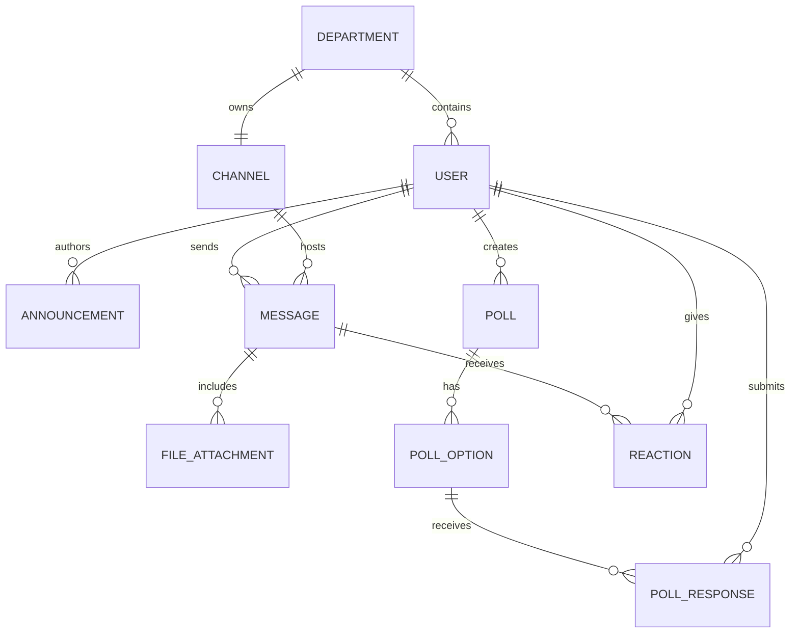

# Conceptual ERD — Employee Communication Platform

## Mermaid Code

## Entity Description Table | Bang mo ta Entity

| # | Entity Name | Vietnamese Name | Description | Key Attributes | Main Relationships |
|---|-------------|-----------------|-------------|----------------|-------------------|
| 1 | USER | Nguoi dung | Tai khoan cua nhan vien tren nen tang | user_id, email, full_name, role, status | belongs to DEPARTMENT, sends MESSAGE |
| 2 | DEPARTMENT | Phong ban | Thong tin cac phong ban trong cong ty | department_id, name, description | contains USER, owns CHANNEL |
| 3 | ANNOUNCEMENT | Thong bao | Cac bai dang tin tuc noi bo cong ty | announcement_id, title, content, is_urgent, created_at | authored by USER |
| 4 | CHANNEL | Kenh giao tiep | Cac kenh chat chung hoac nhom chat | channel_id, name, is_private, created_at | hosts MESSAGE, owned by DEPARTMENT |
| 5 | MESSAGE | Tin nhan | Noi dung tin nhan duoc gui | message_id, content, created_at, type | sent by USER, included in CHANNEL |
| 6 | FILE_ATTACHMENT| Tep dinh kem | Cac file duoc chia se trong tin nhan | file_id, file_name, file_url, size | belongs to MESSAGE |
| 7 | POLL | Khao sat | Cac bai khao sat y kien | poll_id, question, expires_at | created by USER, has POLL_OPTION |
| 8 | POLL_OPTION | Lua chon khao sat | Cac dap an cua mot khao sat | option_id, option_text | belongs to POLL, receives POLL_RESPONSE |
| 9 | POLL_RESPONSE | Phieu khao sat | Lua chon cua nguoi dung khi khao sat | response_id, created_at | belongs to POLL_OPTION, submitted by USER |
| 10| REACTION | Cam xuc | Bieu tuong cam xuc tha vao tin nhan | reaction_id, emoji_code | belongs to MESSAGE, given by USER |

## Relationship Description | Mo ta Quan he

| # | From Entity | Cardinality | To Entity | Relationship Label | Business Explanation |
|---|-------------|-------------|-----------|-------------------|----------------------|
| 1 | DEPARTMENT | one-to-many | USER | contains | Mot phong ban bao gom nhieu nhan vien. |
| 2 | USER | one-to-many | ANNOUNCEMENT | authors | Mot HR Manager (USER) co the dang nhieu thong bao. |
| 3 | USER | one-to-many | MESSAGE | sends | Mot nguoi dung co the gui nhieu tin nhan. |
| 4 | CHANNEL | one-to-many | MESSAGE | hosts | Mot kenh chua nhieu tin nhan. |
| 5 | DEPARTMENT | one-to-one | CHANNEL | owns | Mot phong ban so huu mot kenh chat chung rieng. |
| 6 | MESSAGE | one-to-many | FILE_ATTACHMENT | includes | Mot tin nhan co the dinh kem nhieu file. |
| 7 | USER | one-to-many | POLL | creates | Mot nguoi dung co the tao ra nhieu bai khao sat. |
| 8 | POLL | one-to-many | POLL_OPTION | has | Mot khao sat bao gom nhieu lua chon. |
| 9 | POLL_OPTION | one-to-many | POLL_RESPONSE | receives | Mot lua chon nhan duoc nhieu phieu bau. |
| 10| USER | one-to-many | POLL_RESPONSE | submits | Mot nguoi dung co the gui nhieu phieu bau (tren nhieu khao sat khac nhau). |
| 11| MESSAGE | one-to-many | REACTION | receives | Mot tin nhan co the nhan duoc nhieu cam xuc tha vao. |
| 12| USER | one-to-many | REACTION | gives | Mot nguoi dung co the tha nhieu cam xuc. |
