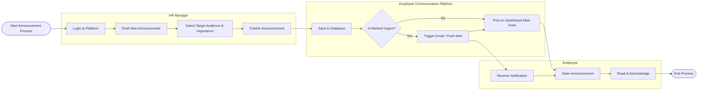

# Swimlane Diagram — Employee Communication Platform

## Mermaid Code

## Flow Description | Mo ta luong

| Lane | Actor | Role in Flow |
|------|-------|-------------|
| 1 | HR Manager | Nguoi khoi tao, soan thao va quyet dinh doi tuong/muc do quan trong cua thong bao truoc khi publish. |
| 2 | Employee Communication Platform | He thong luu tru thong bao, xu ly phan luong (kiem tra do khan cap) de gui canh bao cho nhan vien neu can thiet. |
| 3 | Employee | Nhan vien nhan duoc thong bao qua app hoac email, truy cap vao nen tang de doc va ghi nhan. |
