# Action Tree — Employee Communication Platform

## Mermaid Code

```mermaid
%%{init: {'theme': 'default'}}%%
graph TD
    Root["Employee Communication Platform"]

    Root --> M1["Authentication & Profile"]
    Root --> M2["Announcement Management"]
    Root --> M3["Real-time Messaging"]
    Root --> M4["Collaboration"]
    Root --> M5["System Administration"]

    M1 --> A11["SSO Login"]
    M1 --> A12["Update Profile Info"]
    M1 --> A13["Configure Notifications"]
    M1 --> A14["View Company Directory"]

    M2 --> A21["Create Announcement"]
    M2 --> A22["Edit/Delete Announcement"]
    M2 --> A23["View Main Feed"]
    M2 --> A24["Track Announcement Read Rate"]

    M3 --> A31["Send Direct Message"]
    M3 --> A32["Create Group Chat"]
    M3 --> A33["Send Channel Message"]
    M3 --> A34["Search Message History"]

    M4 --> A41["Share File Attachment"]
    M4 --> A42["Create Poll"]
    M4 --> A43["Vote in Poll"]
    M4 --> A44["React to Message"]

    M5 --> A51["Manage User Accounts"]
    M5 --> A52["Assign Roles"]
    M5 --> A53["Configure Channel Policies"]
    M5 --> A54["Monitor System Usage"]
```

## Module Description | Mo ta Module

| # | Module | Description | Actions |
|---|--------|-------------|---------|
| 1 | Authentication & Profile | Quan ly dang nhap va thong tin ca nhan nguoi dung | SSO Login, Update Profile Info, Configure Notifications, View Company Directory |
| 2 | Announcement Management | Module danh cho dang tai tin tuc, quy dinh tu cong ty | Create Announcement, Edit/Delete Announcement, View Main Feed, Track Announcement Read Rate |
| 3 | Real-time Messaging | Module lien lac chinh de nhan tin ca nhan, nhom, kenh | Send Direct Message, Create Group Chat, Send Channel Message, Search Message History |
| 4 | Collaboration | Cac tinh nang ho tro lam viec cung nhau ngoai chat | Share File Attachment, Create Poll, Vote in Poll, React to Message |
| 5 | System Administration | Module quan tri he thong danh cho System Admin | Manage User Accounts, Assign Roles, Configure Channel Policies, Monitor System Usage |
