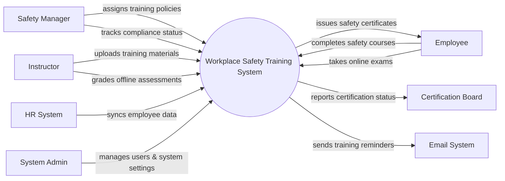

# Context Diagram — Workplace Safety Training System

## Mermaid Code

## Actor & Interaction Table | Bang Actor & Tuong tac

| # | Actor | Actor Type | Data Sent TO System | Data Received FROM System | Notes |
|---|-------|------------|---------------------|---------------------------|-------|
| 1 | Safety Manager | Primary | Training policies, compliance rules | Compliance reports, risk alerts | Quan ly an toan lao dong |
| 2 | Employee | Primary | Exam answers, course completion data | Safety certificates, training materials | Nhan vien tham gia hoc |
| 3 | Instructor | Primary | Course content, assessment grades | Trainee lists, course feedback | Giang vien dao tao |
| 4 | HR System | Supporting | Employee profiles, department structures | Training completion status | He thong nhan su |
| 5 | Certification Board | Regulatory | Certification standards | Employee certification records | To chuc cap chung chi |
| 6 | Email System | Supporting | Email delivery status | Notifications, training reminders | He thong email |
| 7 | System Admin | Primary | System configurations, user roles | System logs, audit reports | Quan tri he thong |

## System Boundary Description | Mo ta Pham vi He thong

The Workplace Safety Training System is designed to manage and deliver safety training courses to employees, ensuring organizational compliance with safety regulations. It provides a platform for Safety Managers to assign courses, Instructors to upload content, and Employees to complete exams and earn certificates. The system does not directly manage core employee HR data; instead, it integrates with the HR System for user synchronization. Additionally, it interacts with external Email Systems for notifications and Certification Boards for regulatory reporting.
