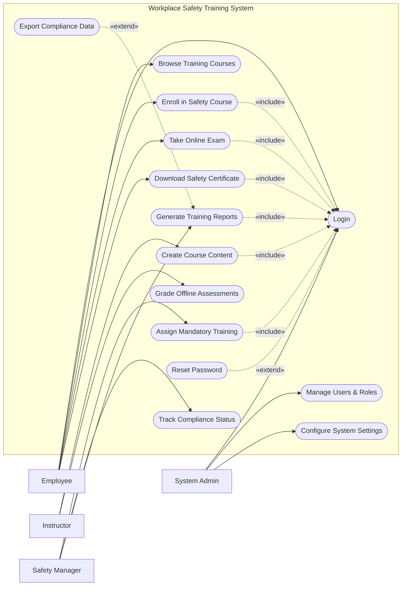

# Use Case Diagram — Workplace Safety Training System

## Mermaid Code

## Actor Table | Bang Actor

| # | Actor | Actor Type | Role Description | Related Use Cases |
|---|-------|------------|------------------|-------------------|
| 1 | Employee | Primary | Nhan vien tham gia cac khoa hoc an toan | UC01, UC02, UC03, UC04, UC05 |
| 2 | Instructor | Primary | Nguoi tao noi dung va cham diem danh gia | UC06, UC07 |
| 3 | Safety Manager | Primary | Nguoi quan ly viec tuan thu an toan lao dong | UC08, UC09, UC10 |
| 4 | System Admin | Primary | Quan tri vien he thong, phan quyen va cai dat | UC01, UC11, UC12 |

## Use Case Table | Bang Use Case

| # | UC ID | Use Case Name | Primary Actor | Secondary Actor | Description | Priority |
|---|-------|---------------|---------------|-----------------|-------------|----------|
| 1 | UC01 | Login | Employee | | Authenticate user access | High |
| 2 | UC02 | Browse Training Courses | Employee | | View available safety courses | Medium |
| 3 | UC03 | Enroll in Safety Course | Employee | | Register for a specific training | High |
| 4 | UC04 | Take Online Exam | Employee | | Complete assessment after training | High |
| 5 | UC05 | Download Safety Certificate| Employee | | Obtain proof of completion | High |
| 6 | UC06 | Create Course Content | Instructor | | Upload videos and documents | High |
| 7 | UC07 | Grade Offline Assessments | Instructor | | Input scores for manual tests | Medium |
| 8 | UC08 | Assign Mandatory Training | Safety Manager | | Force enrollment for employees | High |
| 9 | UC09 | Track Compliance Status | Safety Manager | | Monitor completion rates | High |
| 10| UC10 | Generate Training Reports | Safety Manager | | Create statistical compliance reports | Medium |
| 11| UC11 | Manage Users & Roles | System Admin | | Create or deactivate accounts | High |
| 12| UC12 | Configure System Settings | System Admin | | Update system-wide parameters | Medium |
| 13| UC13 | Reset Password | Employee | | Recover account access | High |
| 14| UC14 | Export Compliance Data | Safety Manager | | Download reports as files | Low |

## Use Case Specification | Dac ta Use Case

---

### UC01 — Login

| Field | Detail |
|-------|--------|
| **UC ID** | UC01 |
| **Use Case Name** | Login |
| **Actor(s)** | Primary: Employee, Instructor, Safety Manager, System Admin |
| **Description** | Cho phep nguoi dung xac thuc de dang nhap vao he thong. |
| **Precondition** | 1. Nguoi dung phai co tai khoan hop le tren he thong.  2. He thong dang hoat dong binh thuong. |
| **Main Flow** | 1. Actor mo trang dang nhap.  2. System hien thi form dang nhap.  3. Actor nhap username va password.  4. Actor nhan nut Submit.  5. System xac thuc thong tin.  6. System chuyen huong den trang chu tuong ung quyen han. |
| **Alternative Flow** | **AF1** — Quen mat khau: Neu Actor chon "Forgot Password", System kich hoat UC13 Reset Password. |
| **Exception Flow** | **EX1** — Sai thong tin: Neu xac thuc that bai, System hien thi thong bao loi va yeu cau nhap lai.  **EX2** — Tai khoan bi khoa: Neu nhap sai qua 5 lan, System khoa tai khoan va thong bao lien he Admin. |
| **Postcondition** | Nguoi dung duoc dang nhap va phien lam viec duoc khoi tao. |
| **Business Rule** | **BR1**: Mat khau phai duoc ma hoa.  **BR2**: Phien dang nhap tu dong het han sau 30 phut khong hoat dong. |

---

### UC03 — Enroll in Safety Course

| Field | Detail |
|-------|--------|
| **UC ID** | UC03 |
| **Use Case Name** | Enroll in Safety Course |
| **Actor(s)** | Primary: Employee |
| **Description** | Cho phep nhan vien dang ky tham gia mot khoa hoc an toan lao dong. |
| **Precondition** | 1. Nhan vien da dang nhap (Include UC01).  2. Khoa hoc dang o trang thai mo dang ky. |
| **Main Flow** | 1. Actor chon khoa hoc tu danh sach.  2. System hien thi chi tiet khoa hoc.  3. Actor nhan nut "Enroll".  4. System xac nhan dieu kien tham gia.  5. System ghi nhan dang ky va them khoa hoc vao danh sach hoc tap cua nhan vien.  6. System hien thi thong bao dang ky thanh cong. |
| **Alternative Flow** | **AF1** — Huy dang ky: Neu truoc buoc 3, Actor chon "Cancel", System quay lai trang danh sach ma khong xu ly. |
| **Exception Flow** | **EX1** — Khoa hoc da day: Neu so luong hoc vien dat toi da, System thong bao loi va chan dang ky.  **EX2** — Thieu dieu kien tien quyet: Neu nhan vien chua hoc khoa co ban, System thong bao yeu cau hoan thanh khoa co ban truoc. |
| **Postcondition** | Nhan vien duoc ghi danh vao khoa hoc voi trang thai "Enrolled". |
| **Business Rule** | **BR1**: Moi nhan vien chi duoc dang ky mot khoa hoc duy nhat cung luc cho cung mot chu de.  **BR2**: Khoa hoc bat buoc phai duoc hoan thanh trong vong 30 ngay tu khi dang ky. |

---

### UC04 — Take Online Exam

| Field | Detail |
|-------|--------|
| **UC ID** | UC04 |
| **Use Case Name** | Take Online Exam |
| **Actor(s)** | Primary: Employee |
| **Description** | Nhan vien thuc hien bai kiem tra danh gia kien thuc sau khi hoan thanh khoa hoc. |
| **Precondition** | 1. Nhan vien da dang nhap (Include UC01).  2. Nhan vien da hoan thanh 100% tien do khoa hoc. |
| **Main Flow** | 1. Actor chon bai thi cua khoa hoc tuong ung.  2. System hien thi cac quy dinh thi va nut "Start Exam".  3. Actor nhan "Start Exam".  4. System bat dau dem nguoc thoi gian va hien thi cau hoi.  5. Actor tra loi cac cau hoi va nhan "Submit".  6. System cham diem tu dong va hien thi ket qua ngay lap tuc. |
| **Alternative Flow** | **AF1** — Luu tam: Actor nhan "Save for later", System luu trang thai cau tra loi hien tai neu chua het thoi gian thi. |
| **Exception Flow** | **EX1** — Het thoi gian: Neu thoi gian dem nguoc ve 0, System tu dong nop bai voi cac cau da tra loi.  **EX2** — Mat ket noi: Neu mat mang, System cho phep tiep tuc tu cau hoi cuoi cung khi co mang lai. |
| **Postcondition** | Ket qua bai thi duoc luu lai va trang thai khoa hoc duoc cap nhat (Pass/Fail). |
| **Business Rule** | **BR1**: Diem dat (Pass) la toi thieu 80/100.  **BR2**: Nhan vien chi duoc phep thi lai toi da 3 lan neu truot. |

---

### UC08 — Assign Mandatory Training

| Field | Detail |
|-------|--------|
| **UC ID** | UC08 |
| **Use Case Name** | Assign Mandatory Training |
| **Actor(s)** | Primary: Safety Manager |
| **Description** | Safety Manager chi dinh khoa hoc an toan bat buoc cho mot nhom nhan vien hoac phong ban. |
| **Precondition** | 1. Safety Manager da dang nhap (Include UC01).  2. Khoa hoc da duoc tao va san sang. |
| **Main Flow** | 1. Actor chon chuc nang "Assign Training".  2. System hien thi danh sach cac khoa hoc va cong cu loc nhan vien.  3. Actor chon khoa hoc va chon cac phong ban hoac nhan vien cu calculations.  4. Actor dat thoi han hoan thanh (Deadline) va nhan "Assign".  5. System tu dong ghi danh cac nhan vien duoc chon.  6. System gui thong bao email va thong bao he thong cho nhung nguoi bi chi dinh. |
| **Alternative Flow** | **AF1** — Chinh sua deadline: Actor chon danh sach da gan va cap nhat lai han cuoi, System se gui thong bao cap nhat. |
| **Exception Flow** | **EX1** — Nhan vien da duoc gan: Neu nhan vien da duoc gan khoa hoc do tu truoc, System bo qua nhan vien do va thong bao danh sach cap nhat. |
| **Postcondition** | Cac nhan vien duoc gan se co khoa hoc o trang thai "Assigned" voi deadline cu the. |
| **Business Rule** | **BR1**: Khoa hoc bat buoc khong the bi huy boi nhan vien.  **BR2**: System phai gui email nhac nho tu dong 3 ngay truoc deadline. |

---

### UC10 — Generate Training Reports

| Field | Detail |
|-------|--------|
| **UC ID** | UC10 |
| **Use Case Name** | Generate Training Reports |
| **Actor(s)** | Primary: Safety Manager |
| **Description** | Safety Manager tao bao cao thong ke ve tien do va ty le tuan thu an toan lao dong. |
| **Precondition** | 1. Safety Manager da dang nhap (Include UC01).  2. Co du lieu hoat dong trong he thong. |
| **Main Flow** | 1. Actor chon module "Reports".  2. System hien thi cac mau bao cao (Compliance Rate, Exam Results, etc.).  3. Actor chon loai bao cao va dat bo loc (thoi gian, phong ban).  4. Actor nhan "Generate".  5. System xu ly du lieu va hien thi ket qua duoi dang bieu do va bang so lieu.  6. Actor xem truc tiep tren man hinh. |
| **Alternative Flow** | **AF1** — Xuat du lieu (Extend UC14): Actor chon "Export to PDF/Excel", System tai file ve may. |
| **Exception Flow** | **EX1** — Khong co du lieu: Neu dieu kien loc khong tra ve ket qua nao, System hien thi thong bao "No data available for selected criteria". |
| **Postcondition** | Bao cao duoc hien thi thanh cong. |
| **Business Rule** | **BR1**: Bao cao tuan thu phai bao gom thong tin chinh xac den tung nhan vien.  **BR2**: Du lieu bao cao cap nhat theo thoi gian thuc. |
