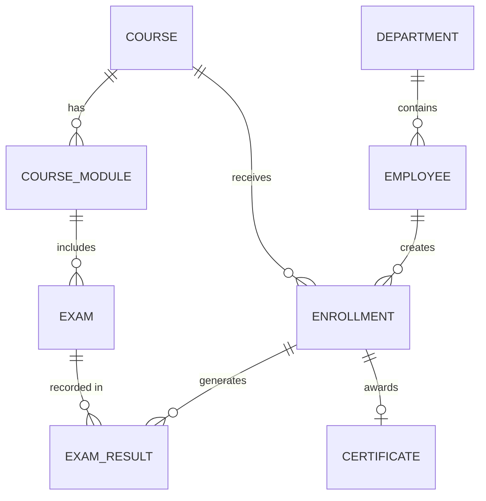

# Conceptual ERD — Workplace Safety Training System

## Mermaid Code

## Entity Description Table | Bang mo ta Entity

| # | Entity Name | Vietnamese Name | Description | Key Attributes | Main Relationships |
|---|-------------|-----------------|-------------|----------------|-------------------|
| 1 | DEPARTMENT | Phong ban | Thong tin cac phong ban trong cong ty | department_id, name | contains EMPLOYEE |
| 2 | EMPLOYEE | Nhan vien | Ho so ca nhan cua nhan vien | employee_id, name, email | belongs to DEPARTMENT |
| 3 | COURSE | Khoa hoc | Thong tin khoa hoc an toan | course_id, title, status | has COURSE_MODULE |
| 4 | COURSE_MODULE | Bai hoc | Cac phan cua mot khoa hoc | module_id, content_type | includes EXAM |
| 5 | ENROLLMENT | Dang ky hoc | Dang ky cua nhan vien cho mot khoa hoc | enrollment_id, date, status | belongs to EMPLOYEE |
| 6 | EXAM | Bai kiem tra | Bai thi danh gia cho tung bai hoc | exam_id, total_score | recorded in EXAM_RESULT |
| 7 | EXAM_RESULT | Ket qua kiem tra | Diem so ma nhan vien dat duoc | result_id, score, passed | belongs to ENROLLMENT |
| 8 | CERTIFICATE | Chung chi | Chung nhan hoan thanh khoa thi | certificate_id, issue_date | belongs to ENROLLMENT |

## Relationship Description | Mo ta Quan he

| # | From Entity | Cardinality | To Entity | Relationship Label | Business Explanation |
|---|-------------|-------------|-----------|-------------------|----------------------|
| 1 | DEPARTMENT | one-to-many | EMPLOYEE | contains | Mot phong ban bao gom nhieu nhan vien. |
| 2 | COURSE | one-to-many | COURSE_MODULE | has | Mot khoa hoc bao gom nhieu bai hoc. |
| 3 | EMPLOYEE | one-to-many | ENROLLMENT | creates | Mot nhan vien co the tao nhieu luot dang ky. |
| 4 | COURSE | one-to-many | ENROLLMENT | receives | Mot khoa hoc co the nhan nhieu luot dang ky tu nhan vien. |
| 5 | COURSE_MODULE | one-to-many | EXAM | includes | Mot bai hoc co the bao gom nhieu bai kiem tra. |
| 6 | ENROLLMENT | one-to-many | EXAM_RESULT | generates | Mot luot dang ky khoa hoc phat sinh nhieu ket qua kiem tra. |
| 7 | EXAM | one-to-many | EXAM_RESULT | recorded in | Mot bai kiem tra duoc luu lai trong nhieu ket qua cua cac nhan vien thi. |
| 8 | ENROLLMENT | one-to-one or zero | CERTIFICATE | awards | Mot luot dang ky hoan thanh co the duoc cap toi da mot chung chi. |
