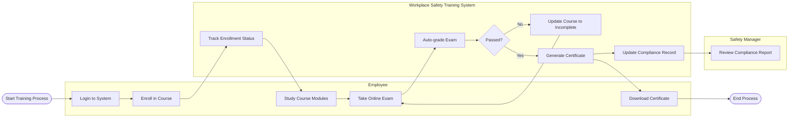

# Swimlane Diagram — Workplace Safety Training System

## Mermaid Code

## Flow Description | Mo ta luong

| Lane | Actor | Role in Flow |
|------|-------|-------------|
| 1 | Employee | Nguoi tiep nhan khoa hoc, hoc cac module, lam bai kiem tra va tai chung chi sau khi dat. |
| 2 | Workplace Safety Training System | He thong theo doi tien do, tu dong cham diem thi, phat hanh chung chi va luu tru du lieu tuan thu. |
| 3 | Safety Manager | Nguoi quan ly nhan bao cao tuan thu sau khi he thong cap nhat ket qua cua nhan vien. |
