# Action Tree — Workplace Safety Training System

## Mermaid Code

```mermaid
%%{init: {'theme': 'default'}}%%
graph TD
    Root["Workplace Safety Training System"]

    Root --> M1["User Management"]
    Root --> M2["Course Management"]
    Root --> M3["Enrollment & Exam"]
    Root --> M4["Compliance & Reporting"]
    Root --> M5["System Configuration"]

    M1 --> A11["Manage Employee Profiles"]
    M1 --> A12["Assign Roles"]
    M1 --> A13["Handle User Authentication"]

    M2 --> A21["Create Safety Courses"]
    M2 --> A22["Upload Course Materials"]
    M2 --> A23["Configure Exam Rules"]

    M3 --> A31["Browse & Enroll Courses"]
    M3 --> A32["Track Study Progress"]
    M3 --> A33["Take Assessments"]
    M3 --> A34["Issue Certificates"]

    M4 --> A41["Assign Mandatory Training"]
    M4 --> A42["Monitor Compliance Rates"]
    M4 --> A43["Export Training Reports"]

    M5 --> A51["Configure Email Templates"]
    M5 --> A52["Manage Notification Rules"]
    M5 --> A53["System Audit Logs"]
```

## Module Description | Mo ta Module

| # | Module | Description | Actions |
|---|--------|-------------|---------|
| 1 | User Management | Quan ly thongquan, tai khoan va phan quyen nguoi dung | Manage Employee Profiles, Assign Roles, Handle User Authentication |
| 2 | Course Management | Xay dung va quan ly noi dung bai hoc, de thi | Create Safety Courses, Upload Course Materials, Configure Exam Rules |
| 3 | Enrollment & Exam | Quan ly qua trinh dang ky, hoc, thi va cap chung chi | Browse & Enroll Courses, Track Study Progress, Take Assessments, Issue Certificates |
| 4 | Compliance & Reporting | Theo doi va kiem soat ty le tuan thu an toan lao dong | Assign Mandatory Training, Monitor Compliance Rates, Export Training Reports |
| 5 | System Configuration | Cai dat cac tham so, thong bao he thong | Configure Email Templates, Manage Notification Rules, System Audit Logs |
