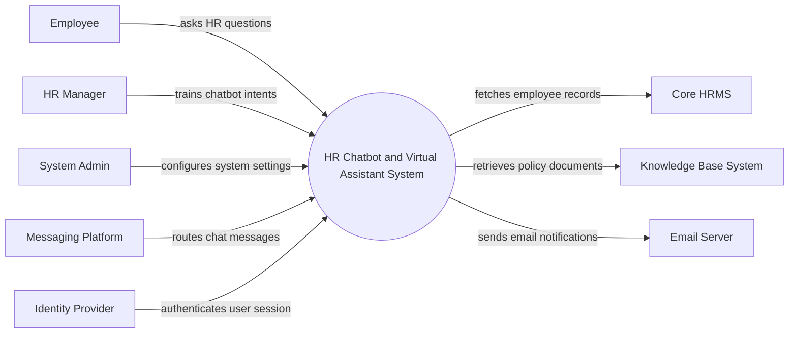

# Context Diagram — HR Chatbot and Virtual Assistant System

## Mermaid Code

## Actor & Interaction Table | Bang Actor & Tuong tac

| # | Actor | Actor Type | Data Sent TO System | Data Received FROM System | Notes |
|---|-------|------------|---------------------|---------------------------|-------|
| 1 | Employee | Primary | Chat messages, requests | Bot responses, ticket statuses | Nhan vien su dung bot |
| 2 | HR Manager | Primary | Intent training data, feedback | Analytics reports, chat logs | Quan ly nhan su |
| 3 | System Admin | Primary | Configuration settings, user roles | System logs, alerts | Quan tri he thong |
| 4 | Core HRMS | Supporting | Employee profile, leave balance, payroll summary | Leave requests, profile updates | He thong nhan su loi |
| 5 | Knowledge Base System | Supporting | Policy documents, FAQs | Search queries | He thong tri thuc |
| 6 | Messaging Platform | Supporting | User messages (Slack/Teams) | Bot replies | Nen tang nhan tin |
| 7 | Email Server | Supporting | Delivery status | Email notifications | He thong email |
| 8 | Identity Provider | Supporting | Authentication token | Login credentials | He thong xac thuc (SSO) |

## System Boundary Description | Mo ta Pham vi He thong

The HR Chatbot and Virtual Assistant System serves as a conversational interface for employees to access HR information and submit routine requests. It interprets user intents using natural language processing and integrates with the Core HRMS and Knowledge Base System to provide accurate answers. The system does not store primary HR records or process payroll directly; it acts as a smart middleware to fetch and update data. It also supports seamless handoffs to human HR agents when the virtual assistant cannot resolve an inquiry.
