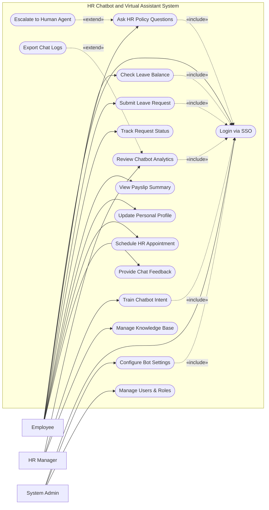

# Use Case Diagram — HR Chatbot and Virtual Assistant System

## Mermaid Code

## Actor Table | Bang Actor

| # | Actor | Actor Type | Role Description | Related Use Cases |
|---|-------|------------|------------------|-------------------|
| 1 | Employee | Primary | Nhan vien can ho tro thong tin nhan su | UC01, UC02, UC03, UC04, UC05, UC07, UC08, UC09, UC13 |
| 2 | HR Manager | Primary | Nhan su quan ly hieu suat bot va tri thuc | UC10, UC11, UC12 |
| 3 | System Admin | Primary | Quan tri vien he thong | UC01, UC15, UC16 |

## Use Case Table | Bang Use Case

| # | UC ID | Use Case Name | Primary Actor | Secondary Actor | Description | Priority |
|---|-------|---------------|---------------|-----------------|-------------|----------|
| 1 | UC01 | Login via SSO | Employee | | Xac thuc nguoi dung qua SSO | High |
| 2 | UC02 | Ask HR Policy Questions | Employee | | Dat cau hoi ve chinh sach nhan su | High |
| 3 | UC03 | Check Leave Balance | Employee | | Xem so ngay phep con lai | High |
| 4 | UC04 | Submit Leave Request | Employee | | Nop don xin nghi phep qua bot | High |
| 5 | UC05 | Track Request Status | Employee | | Kiem tra trang thai cua cac yeu cau | Medium |
| 6 | UC06 | Escalate to Human Agent | Employee | | Chuyen tiep chat cho nhan vien nhan su | High |
| 7 | UC07 | View Payslip Summary | Employee | | Xem tom tat luong hang thang | Medium |
| 8 | UC08 | Update Personal Profile | Employee | | Cap nhat thong tin ca nhan co ban | Low |
| 9 | UC09 | Schedule HR Appointment | Employee | | Dat lich hen voi phong nhan su | Low |
| 10| UC10 | Review Chatbot Analytics | HR Manager | | Xem bao cao hieu suat cua bot | Medium |
| 11| UC11 | Train Chatbot Intent | HR Manager | | Huan luyen bot de nhan dien y dinh tot hon | High |
| 12| UC12 | Manage Knowledge Base | HR Manager | | Quan ly tai lieu va FAQs cho bot | High |
| 13| UC13 | Provide Chat Feedback | Employee | | Danh gia muc do huu ich cua cau tra loi | Medium |
| 14| UC14 | Export Chat Logs | HR Manager | | Xuat du lieu lich su chat | Low |
| 15| UC15 | Configure Bot Settings | System Admin | | Cai dat thong so he thong chatbot | Medium |
| 16| UC16 | Manage Users & Roles | System Admin | | Quan ly tai khoan va phan quyen | High |

## Use Case Specification | Dac ta Use Case

---

### UC02 — Ask HR Policy Questions

| Field | Detail |
|-------|--------|
| **UC ID** | UC02 |
| **Use Case Name** | Ask HR Policy Questions |
| **Actor(s)** | Primary: Employee |
| **Description** | Cho phep nhan vien hoi cac cau hoi ve chinh sach nhan su. |
| **Precondition** | 1. Nhan vien da xac thuc (Include UC01).  2. He thong knowledge base dang hoat dong. |
| **Main Flow** | 1. Actor nhap cau hoi vao cua so chat.  2. System phan tich y dinh (intent) cua cau hoi.  3. System tim kiem thong tin trong Knowledge Base.  4. System tong hop cau tra loi va hien thi cho Actor.  5. System hoi Actor xem cau tra loi co huu ich khong (Goi y UC13). |
| **Alternative Flow** | **AF1** — Intent khong ro rang: Neu he thong khong chac chan, no hien thi 2-3 lua chon de Actor chon truoc khi tra loi. |
| **Exception Flow** | **EX1** — Khong co cau tra loi: Neu System khong tim thay thong tin, kich hoat UC06 Escalate to Human Agent.  **EX2** — Loi ket noi KB: He thong bao loi va yeu cau thu lai sau. |
| **Postcondition** | Cau hoi duoc giai dap hoac duoc chuyen cho nhan vien nhan su. |
| **Business Rule** | **BR1**: Bot phai tra loi trong vong 3 giay.  **BR2**: Nhung cau hoi ngoai pham vi HR se bi tu choi tra loi. |

---

### UC04 — Submit Leave Request

| Field | Detail |
|-------|--------|
| **UC ID** | UC04 |
| **Use Case Name** | Submit Leave Request |
| **Actor(s)** | Primary: Employee |
| **Description** | Cho phep nhan vien nop don xin nghi phep thong qua giao dien chat. |
| **Precondition** | 1. Nhan vien da xac thuc (Include UC01).  2. He thong Core HRMS san sang de ket noi. |
| **Main Flow** | 1. Actor nhan "I want to take a leave".  2. System hoi loai phep, ngay bat dau va ngay ket thuc.  3. Actor cung cap thong tin theo tung buoc chat.  4. System xac nhan lai toan bo thong tin voi Actor.  5. Actor nhan "Confirm".  6. System gui API de tao request tren Core HRMS va thong bao thanh cong. |
| **Alternative Flow** | **AF1** — Huy giua chung: Actor co the go "Cancel" bat cu luc nao de dung quy trinh. |
| **Exception Flow** | **EX1** — Khong du phep: System kiem tra va bao rang so ngay phep con lai khong du.  **EX2** — Ngay khong hop le: Actor chon ngay trong qua khu, System yeu cau chon lai. |
| **Postcondition** | Don nghi phep duoc tao thanh cong tren Core HRMS. |
| **Business Rule** | **BR1**: Thong tin nghi phep phai duoc xac nhan lai boi nguoi dung truoc khi tao tren he thong Core. |

---

### UC06 — Escalate to Human Agent

| Field | Detail |
|-------|--------|
| **UC ID** | UC06 |
| **Use Case Name** | Escalate to Human Agent |
| **Actor(s)** | Primary: Employee |
| **Description** | Chuyen tiep cuoc hoi thoai tu Bot sang nhan vien HR that. |
| **Precondition** | 1. Nhan vien dang trong phien chat.  2. Co HR Agent dang online. |
| **Main Flow** | 1. System khong the tra loi hoac Actor chu dong yeu cau "Talk to human".  2. System tao mot ticket trong he thong va chuyen lich su chat cho agent.  3. System thong bao cho Actor "Connecting you to an HR representative...".  4. HR Agent tham gia vao phien chat va tra loi Actor. |
| **Alternative Flow** | **AF1** — Khong co ai online: System se yeu cau Actor de lai loi nhan de tao ticket offline. |
| **Exception Flow** | **EX1** — Loi tao ticket: System thong bao loi va huong dan lien he qua email HR. |
| **Postcondition** | Cuoc hoi thoai duoc tiep quan boi con nguoi, ticket duoc luu lai. |
| **Business Rule** | **BR1**: Toan bo lich su chat voi bot phai duoc chuyen cho Human Agent doc truoc. |

---

### UC11 — Train Chatbot Intent

| Field | Detail |
|-------|--------|
| **UC ID** | UC11 |
| **Use Case Name** | Train Chatbot Intent |
| **Actor(s)** | Primary: HR Manager |
| **Description** | Quan ly nhan su cung cap du lieu de huan luyen chatbot nhan dien dung y dinh nguoi dung. |
| **Precondition** | 1. HR Manager da xac thuc (Include UC01).  2. He thong co cac tin nhan khong nhan dien duoc y dinh. |
| **Main Flow** | 1. Actor vao man hinh "Intent Training".  2. System hien thi danh sach cac cau hoi bot khong hieu.  3. Actor chon mot cau hoi va gan no vao mot intent co san hoac tao intent moi.  4. Actor nhan "Save & Retrain".  5. System cap nhat mo hinh NLP va thong bao hoan tat. |
| **Alternative Flow** | **AF1** — Loai bo cau hoi: Actor danh dau cau hoi la "spam" hoac "irrelevant" de bo qua. |
| **Exception Flow** | **EX1** — Loi retrain: Neu huan luyen that bai, he thong se phuc hoi ban cu va bao loi. |
| **Postcondition** | Chatbot hieu duoc cau hoi vua duoc huan luyen trong cac lan chat tiep theo. |
| **Business Rule** | **BR1**: Moi intent can it nhat 5 vi du de huan luyen hieu qua. |

---

### UC12 — Manage Knowledge Base

| Field | Detail |
|-------|--------|
| **UC ID** | UC12 |
| **Use Case Name** | Manage Knowledge Base |
| **Actor(s)** | Primary: HR Manager |
| **Description** | Quan ly va cap nhat cac tai lieu, bai viet dung de tra loi cau hoi. |
| **Precondition** | 1. HR Manager da xac thuc (Include UC01). |
| **Main Flow** | 1. Actor vao man hinh "Knowledge Base".  2. Actor chon "Add New Article".  3. Actor nhap tieu de, noi dung, va cac tu khoa lien quan.  4. Actor nhan "Publish".  5. System luu bai viet va cap nhat index tim kiem. |
| **Alternative Flow** | **AF1** — Sua bai viet: Actor tim bai viet cu, cap nhat noi dung va luu lai. |
| **Exception Flow** | **EX1** — Thieu noi dung: System bao loi neu de trong tieu de hoac noi dung. |
| **Postcondition** | Bai viet duoc dua vao he thong va chatbot co the su dung de tra loi ngay lap tuc. |
| **Business Rule** | **BR1**: Cac bai viet phai co do phan giai muc truy cap neu chua thong tin nhay cam. |
