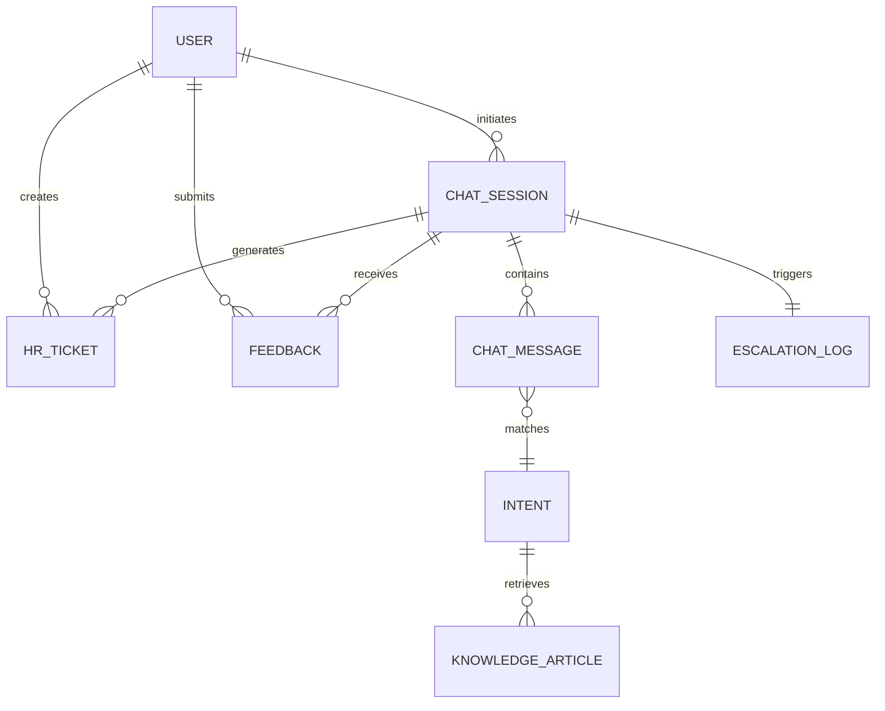

# Conceptual ERD — HR Chatbot and Virtual Assistant System

## Mermaid Code

## Entity Description Table | Bang mo ta Entity

| # | Entity Name | Vietnamese Name | Description | Key Attributes | Main Relationships |
|---|-------------|-----------------|-------------|----------------|-------------------|
| 1 | USER | Nguoi dung | Thong tin nguoi dung he thong (Employee, Admin...) | user_id, email, role | initiates CHAT_SESSION |
| 2 | CHAT_SESSION | Phien chat | Phien lam viec tro chuyen giua nguoi dung va bot | session_id, start_time | contains CHAT_MESSAGE |
| 3 | CHAT_MESSAGE | Tin nhan chat | Noi dung chat cua nguoi dung hoac cua bot | message_id, text, sender | matches INTENT |
| 4 | INTENT | Y dinh | Y dinh duoc he thong phan tich tu tin nhan | intent_id, name, confidence | retrieves KNOWLEDGE_ARTICLE |
| 5 | KNOWLEDGE_ARTICLE | Bai viet tri thuc| Tai lieu hoac FAQ de chatbot tra loi | article_id, title, content | belongs to INTENT |
| 6 | HR_TICKET | Phieu yeu cau | Ticket duoc tao cho yeu cau nhan su hoac escalate | ticket_id, status, type | belongs to USER |
| 7 | FEEDBACK | Danh gia | Danh gia cua nguoi dung ve chat luong tra loi | feedback_id, rating, comment | belongs to CHAT_SESSION |
| 8 | ESCALATION_LOG | Nhat ky chuyen tiep| Lich su chuyen phien chat cho nhan vien that | escalation_id, timestamp | belongs to CHAT_SESSION |

## Relationship Description | Mo ta Quan he

| # | From Entity | Cardinality | To Entity | Relationship Label | Business Explanation |
|---|-------------|-------------|-----------|-------------------|----------------------|
| 1 | USER | one-to-many | CHAT_SESSION | initiates | Mot nguoi dung co the bat dau nhieu phien chat. |
| 2 | USER | one-to-many | HR_TICKET | creates | Mot nguoi dung co the tao nhieu phieu yeu cau. |
| 3 | USER | one-to-many | FEEDBACK | submits | Mot nguoi dung co the gui nhieu danh gia khac nhau. |
| 4 | CHAT_SESSION | one-to-many | CHAT_MESSAGE | contains | Mot phien chat chua nhieu tin nhan. |
| 5 | CHAT_SESSION | one-to-many | HR_TICKET | generates | Mot phien chat co the sinh ra cac phieu yeu cau. |
| 6 | CHAT_SESSION | one-to-many | FEEDBACK | receives | Mot phien chat co the nhan danh gia sau khi ket thuc. |
| 7 | CHAT_MESSAGE | many-to-one | INTENT | matches | Nhieu tin nhan co the chung mot y dinh. |
| 8 | INTENT | one-to-many | KNOWLEDGE_ARTICLE | retrieves | Mot y dinh co the truy xuat nhieu bai viet tri thuc de tra loi. |
| 9 | CHAT_SESSION | one-to-one | ESCALATION_LOG | triggers | Mot phien chat co the kich hoat mot lan chuyen tiep cho agent that. |
