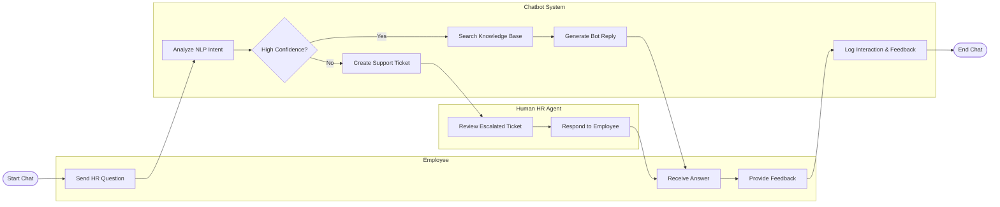

# Swimlane Diagram — HR Chatbot and Virtual Assistant System

## Mermaid Code

## Flow Description | Mo ta luong

| Lane | Actor | Role in Flow |
|------|-------|-------------|
| 1 | Employee | Nguoi dung khoi tao cau hoi, nhan ket qua va the hien danh gia cuoi cung. |
| 2 | Chatbot System | He thong phan tich y dinh (NLP), dua ra quyet dinh tra loi tu dong hoac chuyen cho nhan vien that neu do tin cay thap. |
| 3 | Human HR Agent | Nhan vien tiep nhan nhung yeu cau vuot qua kha nang cua bot, xu ly va tra loi bu lai cho nguoi dung. |
