# Action Tree — HR Chatbot and Virtual Assistant System

## Mermaid Code

```mermaid
%%{init: {'theme': 'default'}}%%
graph TD
    Root["HR Chatbot and Virtual Assistant System"]

    Root --> M1["Conversational Interface"]
    Root --> M2["Intent & NLP Engine"]
    Root --> M3["Core HR Integration"]
    Root --> M4["Knowledge Management"]
    Root --> M5["Analytics & Reporting"]

    M1 --> A11["Initiate Chat Session"]
    M1 --> A12["Process User Input"]
    M1 --> A13["Handle Rich Media Messages"]
    M1 --> A14["Escalate to Human Agent"]

    M2 --> A21["Detect User Intent"]
    M2 --> A22["Extract Entities"]
    M2 --> A23["Manage Conversation Context"]
    M2 --> A24["Train NLP Model"]

    M3 --> A31["Fetch Employee Profile"]
    M3 --> A32["Check Leave Balance"]
    M3 --> A33["Submit HR Request"]
    M3 --> A34["Retrieve Payslip Summary"]

    M4 --> A41["Create KB Article"]
    M4 --> A42["Update Existing FAQ"]
    M4 --> A43["Search Knowledge Base"]
    M4 --> A44["Categorize HR Topics"]

    M5 --> A51["View Chat Volume Analytics"]
    M5 --> A52["Monitor Bot Accuracy"]
    M5 --> A53["Review User Feedback"]
    M5 --> A54["Export System Logs"]
```

## Module Description | Mo ta Module

| # | Module | Description | Actions |
|---|--------|-------------|---------|
| 1 | Conversational Interface | Cung cap giao dien tro chuyen va quan ly phien cho nguoi dung. | Initiate Chat Session, Process User Input, Handle Rich Media Messages, Escalate to Human Agent |
| 2 | Intent & NLP Engine | Xu ly ngon ngu tu nhien, hieu y dinh va dao tao mo hinh. | Detect User Intent, Extract Entities, Manage Conversation Context, Train NLP Model |
| 3 | Core HR Integration | Ket noi truc tiep den cac phan he quan ly nhan su de truy xuat va cap nhat du lieu. | Fetch Employee Profile, Check Leave Balance, Submit HR Request, Retrieve Payslip Summary |
| 4 | Knowledge Management | Quan ly kho tri thuc duoc dung boi chatbot de tra loi. | Create KB Article, Update Existing FAQ, Search Knowledge Base, Categorize HR Topics |
| 5 | Analytics & Reporting | Cung cap thong ke ve hieu suat cua chatbot va su hai long. | View Chat Volume Analytics, Monitor Bot Accuracy, Review User Feedback, Export System Logs |
