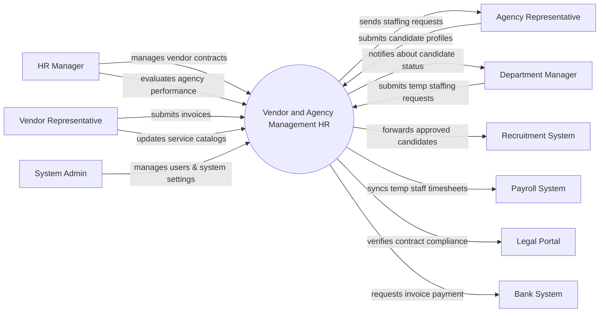

# Context Diagram — Vendor and Agency Management HR

## Mermaid Code

## Actor & Interaction Table | Bang Actor & Tuong tac

| # | Actor | Actor Type | Data Sent TO System | Data Received FROM System | Notes |
|---|-------|------------|---------------------|---------------------------|-------|
| 1 | HR Manager | Primary | Vendor contracts, performance evaluations | Reports, compliance alerts | Quan tri vien nhan su quan ly doi tac |
| 2 | Agency Representative | Primary | Candidate profiles, agency details | Staffing requests, feedback | Dai dien don vi cung cap nhan su |
| 3 | Vendor Representative | Primary | Invoices, service catalogs | Payment statuses, contract renewals | Dai dien don vi cung cap dich vu |
| 4 | Department Manager | Primary | Temporary staffing requests | Candidate review statuses | Quan ly bo phan can thue ngoai |
| 5 | Recruitment System | Supporting | Recruitment status updates | Approved candidate profiles | He thong tuyen dung noi bo |
| 6 | Payroll System | Supporting | Payroll processing status | Temporary staff timesheets | He thong tinh luong |
| 7 | Legal Portal | Regulatory | Compliance policies, blacklists | Contract details for verification | Cong thong tin phap ly |
| 8 | Bank System | Supporting | Payment transaction statuses | Invoice payment requests | He thong ngan hang thuc hien thanh toan |
| 9 | System Admin | Primary | System configurations, user roles | System logs, audit reports | Quan tri he thong |

## System Boundary Description | Mo ta Pham vi He thong

The Vendor and Agency Management HR system centralizes the management of external HR service providers and recruitment agencies. It handles the full lifecycle of vendor engagement, from contract creation and candidate submissions to invoice tracking and performance evaluation. The system does not directly execute financial payments or internal payroll; instead, it integrates with Bank Systems and Payroll Systems for these functions. Additionally, compliance checking relies on external Legal Portals, ensuring that the HRMS only manages data within the defined HR vendor management scope.
