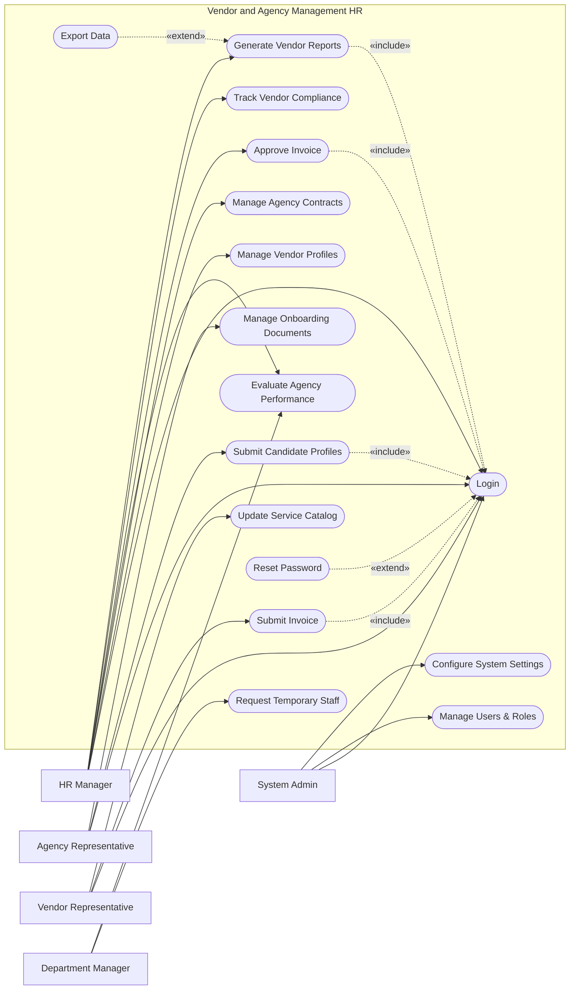

# Use Case Diagram — Vendor and Agency Management HR

## Mermaid Code

## Actor Table | Bang Actor

| # | Actor | Actor Type | Role Description | Related Use Cases |
|---|-------|------------|------------------|-------------------|
| 1 | HR Manager | Primary | Quan ly hoat dong cua vendor va agency | UC01, UC02, UC03, UC05, UC07, UC09, UC10 |
| 2 | Agency Representative | Primary | Dai dien agency cung cap nhan su | UC01, UC04, UC12 |
| 3 | Vendor Representative | Primary | Dai dien vendor cung cap dich vu nhan su | UC01, UC06, UC11 |
| 4 | Department Manager | Primary | Quan ly bo phan can thue ngoai hoac agency | UC05, UC08 |
| 5 | System Admin | Primary | Quan tri he thong, phan quyen va thiet lap | UC01, UC15, UC16 |

## Use Case Table | Bang Use Case

| # | UC ID | Use Case Name | Primary Actor | Secondary Actor | Description | Priority |
|---|-------|---------------|---------------|-----------------|-------------|----------|
| 1 | UC01 | Login | HR Manager | | Authenticate user access | High |
| 2 | UC02 | Manage Vendor Profiles | HR Manager | | Update and maintain vendor information | Medium |
| 3 | UC03 | Manage Agency Contracts | HR Manager | Legal Portal | Create and monitor contracts | High |
| 4 | UC04 | Submit Candidate Profiles | Agency Representative | | Upload candidates for staffing requests | High |
| 5 | UC05 | Evaluate Agency Performance | HR Manager | Department Manager | Rate agencies based on provided services | Medium |
| 6 | UC06 | Submit Invoice | Vendor Representative | | Upload invoices for payment | High |
| 7 | UC07 | Approve Invoice | HR Manager | Bank System | Review and approve vendor invoices | High |
| 8 | UC08 | Request Temporary Staff | Department Manager | HR Manager | Initiate a request for temporary workers | High |
| 9 | UC09 | Track Vendor Compliance | HR Manager | Legal Portal | Monitor vendor adherence to regulations | High |
| 10| UC10 | Generate Vendor Reports | HR Manager | | Create statistical reports on vendors | Medium |
| 11| UC11 | Update Service Catalog | Vendor Representative | | Update offered HR services and pricing | Low |
| 12| UC12 | Manage Onboarding Documents | Agency Representative | | Upload documents for new temps | Medium |
| 13| UC13 | Reset Password | HR Manager | | Recover account access | High |
| 14| UC14 | Export Data | HR Manager | | Download vendor reports as files | Low |
| 15| UC15 | Manage Users & Roles | System Admin | | Create, update, or deactivate accounts | High |
| 16| UC16 | Configure System Settings | System Admin | | Update system-wide preferences | Medium |

## Use Case Specification | Dac ta Use Case

---

### UC01 — Login

| Field | Detail |
|-------|--------|
| **UC ID** | UC01 |
| **Use Case Name** | Login |
| **Actor(s)** | Primary: HR Manager, Agency Representative, Vendor Representative, System Admin |
| **Description** | Cho phep nguoi dung xac thuc de dang nhap vao he thong quan ly vendor. |
| **Precondition** | 1. Nguoi dung da duoc cap tai khoan tren he thong.  2. He thong mang on dinh. |
| **Main Flow** | 1. Actor mo trang dang nhap.  2. System hien thi form dang nhap.  3. Actor nhap email va password.  4. Actor nhan Submit.  5. System kiem tra xac thuc.  6. System chuyen huong toi dashboard tuong ung voi role. |
| **Alternative Flow** | **AF1** — Quen mat khau: Actor chon "Forgot Password", System kich hoat UC13. |
| **Exception Flow** | **EX1** — Sai thong tin: System bao loi va yeu cau nhap lai.  **EX2** — Tai khoan bi khoa: System hien thi thong bao lien he Admin. |
| **Postcondition** | Phien dang nhap duoc thiet lap thanh cong. |
| **Business Rule** | **BR1**: Phien lam viec tu dong out sau 30 phut inactivity.  **BR2**: Password ma hoa 2 chieu. |

---

### UC04 — Submit Candidate Profiles

| Field | Detail |
|-------|--------|
| **UC ID** | UC04 |
| **Use Case Name** | Submit Candidate Profiles |
| **Actor(s)** | Primary: Agency Representative |
| **Description** | Cho phep Agency nop ho so ung vien de dap ung yeu cau tuyen dung tu cong ty. |
| **Precondition** | 1. Agency da dang nhap (Include UC01).  2. Co it nhat mot yeu cau nhan su (Staffing Request) dang mo. |
| **Main Flow** | 1. Actor chon mot Staffing Request tren he thong.  2. Actor chon chuc nang "Submit Candidate".  3. System hien thi form nhap thong tin ung vien.  4. Actor tai len CV va nhien thong tin co ban.  5. Actor nhan Submit.  6. System luu ho so, cap nhat trang thai Request va thong bao den HR Manager. |
| **Alternative Flow** | **AF1** — Luu nhap: Truoc buoc 5, Actor chon "Save Draft" de luu lai ho so chua hoan thien. |
| **Exception Flow** | **EX1** — File qua lon: Neu CV vuot qua dung luong cho phep, System thong bao loi va yeu cau upload lai. |
| **Postcondition** | Ho so ung vien duoc luu tren he thong duoi trang thai "Submitted". |
| **Business Rule** | **BR1**: Mot agency khong the gui cung mot ung vien nhieu lan cho mot request.  **BR2**: CV phai duoc dinh dang PDF hoac DOCX. |

---

### UC06 — Submit Invoice

| Field | Detail |
|-------|--------|
| **UC ID** | UC06 |
| **Use Case Name** | Submit Invoice |
| **Actor(s)** | Primary: Vendor Representative |
| **Description** | Vendor tai len hoa don yeu cau thanh toan cho cac dich vu da cung cap. |
| **Precondition** | 1. Vendor da dang nhap (Include UC01).  2. Vendor co hop dong dang co hieu luc. |
| **Main Flow** | 1. Actor vao muc "Invoice Management".  2. Actor chon tao hoa don moi (New Invoice).  3. System hien thi danh sach cac dich vu/san pham da ban giao.  4. Actor chon cac hang muc can thanh toan va upload file hoa don gôc (PDF).  5. Actor nhan Submit.  6. System luu hoa don voi trang thai "Pending Approval" va thong bao cho HR Manager. |
| **Alternative Flow** | **AF1** — Huy tao: Actor chon "Cancel", he thong tro ve man hinh danh sach hoa don. |
| **Exception Flow** | **EX1** — Chua upload file: System chan Submit va yeu cau them file dinh kem. |
| **Postcondition** | Hoa don duoc ghi nhan va dang cho HR phe duyet. |
| **Business Rule** | **BR1**: Tong tien tren hoa don khong duoc vuot qua gioi han cua hop dong.  **BR2**: So hoa don phai la duy nhat trong he thong cua cung mot vendor. |

---

### UC07 — Approve Invoice

| Field | Detail |
|-------|--------|
| **UC ID** | UC07 |
| **Use Case Name** | Approve Invoice |
| **Actor(s)** | Primary: HR Manager / Secondary: Bank System |
| **Description** | HR Manager kiem tra va phe duyet hoa don do Vendor gui len. |
| **Precondition** | 1. HR Manager da dang nhap (Include UC01).  2. Co hoa don o trang thai "Pending Approval". |
| **Main Flow** | 1. Actor chon muc "Pending Invoices".  2. System hien thi danh sach hoa don cho duyet.  3. Actor mo xem chi tiet mot hoa don (file dinh kem va hang muc).  4. Actor chon "Approve".  5. System cap nhat trang thai thanh "Approved for Payment".  6. System tich hop Bank System de len lich thanh toan (tuy chon) va gui email cho Vendor. |
| **Alternative Flow** | **AF1** — Tu choi: Actor chon "Reject" va nhap ly do (vi du: sai so tien). System doi trang thai thanh "Rejected" va thong bao cho Vendor. |
| **Exception Flow** | **EX1** — Hoa don da duoc xu ly boi nguoi khac: System bao loi va lam moi danh sach hoa don. |
| **Postcondition** | Hoa don chuyen sang trang thai da duyet hoac bi tu choi. |
| **Business Rule** | **BR1**: Hoa don tren 10,000 USD can co su xac nhan them tu Giam doc Tai chinh (Ngoai le workflow he thong hoac he thong thong bao offline).  **BR2**: Chi hoa don "Approved" moi duoc xuyen xuat de thanh toan. |

---
