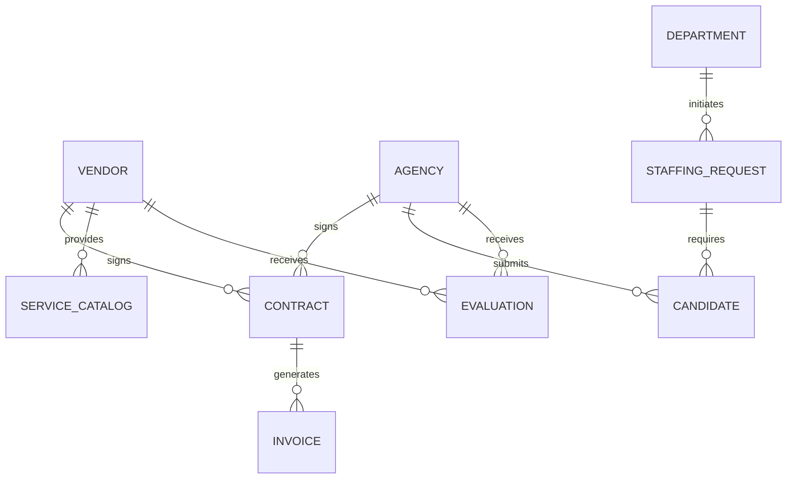

# Conceptual ERD — Vendor and Agency Management HR

## Mermaid Code

## Entity Description Table | Bang mo ta Entity

| # | Entity Name | Vietnamese Name | Description | Key Attributes | Main Relationships |
|---|-------------|-----------------|-------------|----------------|-------------------|
| 1 | VENDOR | Nha cung cap | Thong tin cua cac nha cung cap dich vu HR | vendor_id, name, tax_code | signs CONTRACT, receives EVALUATION |
| 2 | AGENCY | Dai ly tuyen dung | Thong tin cua cac agency cung cap nhan su | agency_id, name, specialization | signs CONTRACT, submits CANDIDATE |
| 3 | CONTRACT | Hop dong | Thong tin thoa thuan hop tac voi vendor/agency | contract_id, start_date, end_date | generates INVOICE |
| 4 | INVOICE | Hoa don | Cac yeu cau thanh toan tu vendor/agency | invoice_id, amount, status | belongs to CONTRACT |
| 5 | CANDIDATE | Ung vien | Thong tin ung vien do agency de xuat | candidate_id, name, cv_url | belongs to AGENCY, requires STAFFING_REQUEST |
| 6 | STAFFING_REQUEST | Yeu cau nhan su | Yeu cau tuyen thue ngoai tu cac phong ban | request_id, position, status | requires CANDIDATE, initiated by DEPARTMENT |
| 7 | EVALUATION | Danh gia | Diem danh gia hieu suat cua vendor/agency | evaluation_id, score, comments | belongs to VENDOR or AGENCY |
| 8 | SERVICE_CATALOG | Danh muc dich vu | Cac dich vu ma vendor dang cung cap | service_id, description, price | belongs to VENDOR |
| 9 | DEPARTMENT | Phong ban | Phong ban noi bo yeu cau nhan su/dich vu | department_id, name | initiates STAFFING_REQUEST |

## Relationship Description | Mo ta Quan he

| # | From Entity | Cardinality | To Entity | Relationship Label | Business Explanation |
|---|-------------|-------------|-----------|-------------------|----------------------|
| 1 | VENDOR | one-to-many | CONTRACT | signs | Mot vendor co the ky nhieu hop dong. |
| 2 | AGENCY | one-to-many | CONTRACT | signs | Mot agency co the ky nhieu hop dong. |
| 3 | CONTRACT | one-to-many | INVOICE | generates | Mot hop dong co the phat sinh nhieu hoa don. |
| 4 | AGENCY | one-to-many | CANDIDATE | submits | Mot agency co the gui nhieu ung vien. |
| 5 | VENDOR | one-to-many | SERVICE_CATALOG | provides | Mot vendor co the cung cap nhieu dich vu. |
| 6 | DEPARTMENT | one-to-many | STAFFING_REQUEST | initiates | Mot phong ban co the tao nhieu yeu cau nhan su. |
| 7 | STAFFING_REQUEST | one-to-many | CANDIDATE | requires | Mot yeu cau co the nhan nhieu ung vien. |
| 8 | AGENCY | one-to-many | EVALUATION | receives | Mot agency co the nhan nhieu luot danh gia. |
| 9 | VENDOR | one-to-many | EVALUATION | receives | Mot vendor co the nhan nhieu luot danh gia. |
