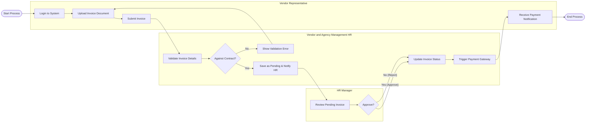

# Swimlane Diagram — Vendor and Agency Management HR

## Mermaid Code

## Flow Description | Mo ta luong

| Lane | Actor | Role in Flow |
|------|-------|-------------|
| 1 | Vendor Representative | Nguoi chu dong tao va nop hoa don thanh toan cho cac dich vu da thuc hien. |
| 2 | Vendor and Agency Management HR | He thong kiem tra doi chieu voi hop dong, luu trang thai hoa don, ket noi voi he thong tai chinh va thong bao. |
| 3 | HR Manager | Nguoi quan ly chiu trach nhiem kiem tra cuoi cung va duyet/tu choi hoa don tu Vendor. |
