# Action Tree — Vendor and Agency Management HR

## Mermaid Code

```mermaid
%%{init: {'theme': 'default'}}%%
graph TD
    Root["Vendor and Agency Management HR"]

    Root --> M1["Vendor Profiles"]
    Root --> M2["Agency Profiles"]
    Root --> M3["Contract Management"]
    Root --> M4["Staffing Requests"]
    Root --> M5["Invoice & Payments"]
    Root --> M6["Performance Evaluation"]

    M1 --> A11["Onboard New Vendor"]
    M1 --> A12["Update Vendor Details"]
    M1 --> A13["Manage Service Catalog"]
    
    M2 --> A21["Register New Agency"]
    M2 --> A22["Update Agency Information"]
    M2 --> A23["Manage Agency Specialties"]

    M3 --> A31["Create New Contract"]
    M3 --> A32["Renew Existing Contract"]
    M3 --> A33["Terminate Contract"]
    M3 --> A34["Monitor Compliance"]

    M4 --> A41["Create Staffing Request"]
    M4 --> A42["Submit Candidate Resumes"]
    M4 --> A43["Review Candidates"]
    M4 --> A44["Approve/Reject Candidates"]

    M5 --> A51["Submit Invoice"]
    M5 --> A52["Approve/Reject Invoice"]
    M5 --> A53["Track Payment Status"]
    M5 --> A54["Export Financial Report"]

    M6 --> A61["Create Feedback Survey"]
    M6 --> A62["Submit Agency Rating"]
    M6 --> A63["View Vendor Scorecard"]
```

## Module Description | Mo ta Module

| # | Module | Description | Actions |
|---|--------|-------------|---------|
| 1 | Vendor Profiles | Quan ly thong tin ho so cua cac nha cung cap | Onboard New Vendor, Update Vendor Details, Manage Service Catalog |
| 2 | Agency Profiles | Quan ly danh sach cac cong ty san dau nguoi/tuyen dung | Register New Agency, Update Agency Information, Manage Agency Specialties |
| 3 | Contract Management | Quan ly vong doi cua cac hop dong thue ngoai | Create New Contract, Renew Existing Contract, Terminate Contract, Monitor Compliance |
| 4 | Staffing Requests | Quy trinh yeu cau va nhan ung vien tu agency | Create Staffing Request, Submit Candidate Resumes, Review Candidates, Approve/Reject Candidates |
| 5 | Invoice & Payments | Quy trinh tiep nhan, duyet hoa don va theo doi thanh toan | Submit Invoice, Approve/Reject Invoice, Track Payment Status, Export Financial Report |
| 6 | Performance Evaluation | Chuc nang danh gia chat luong dich vu cua doi tac | Create Feedback Survey, Submit Agency Rating, View Vendor Scorecard |
