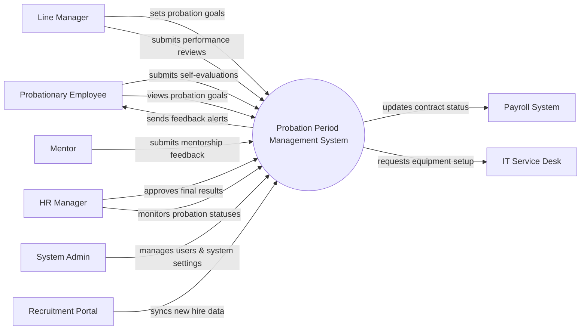

# Context Diagram — Probation Period Management System

## Mermaid Code

## Actor & Interaction Table | Bang Actor & Tuong tac

| # | Actor | Actor Type | Data Sent TO System | Data Received FROM System | Notes |
|---|-------|------------|---------------------|---------------------------|-------|
| 1 | Probationary Employee | Primary | Self-evaluations, task updates | Probation goals, feedback, final result | Nhan vien thu viec |
| 2 | Line Manager | Primary | Goals, performance reviews, result decisions | Probationer progress, self-evaluations | Quan ly truc tiep |
| 3 | Mentor | Primary | Mentorship feedback, task observations | Assigned mentee list, goals | Nguoi huong dan |
| 4 | HR Manager | Primary | Final approvals, policy configurations | Probation reports, status alerts | Quan ly nhan su |
| 5 | System Admin | Primary | User roles, system configurations | System logs, error alerts | Quan tri he thong |
| 6 | Recruitment Portal | Supporting | New hire profiles, initial roles | Sync confirmation | He thong tuyen dung |
| 7 | Payroll System | Supporting | Salary adjustment confirmation | Contract status updates | He thong tinh luong |
| 8 | IT Service Desk | Supporting | Equipment status | Equipment requests for new hires | He thong IT |

## System Boundary Description | Mo ta Pham vi He thong

The Probation Period Management System is responsible for tracking and evaluating the performance of new hires during their probation period. It serves as a centralized platform for Probationers, Line Managers, Mentors, and HR Managers to set goals, provide feedback, and make final employment decisions. The system does not directly manage candidate sourcing or process payroll; instead, it receives new hire data from the Recruitment Portal and sends contract updates to the Payroll System. It also handles internal role configurations via the System Admin.
