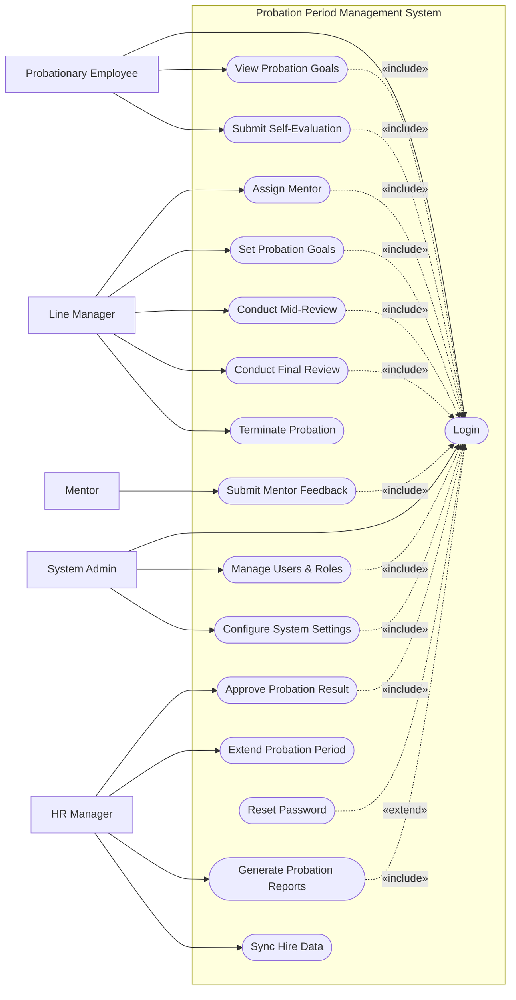

# Use Case Diagram — Probation Period Management System

## Mermaid Code

## Actor Table | Bang Actor

| # | Actor | Actor Type | Role Description | Related Use Cases |
|---|-------|------------|------------------|-------------------|
| 1 | Probationary Employee | Primary | Nhan vien dang trong thoi gian thu viec | UC01, UC02, UC03 |
| 2 | Line Manager | Primary | Nguoi quan ly va danh gia chinh | UC04, UC05, UC06, UC07, UC11 |
| 3 | Mentor | Primary | Nguoi huong dan truc tiep cong viec hang ngay | UC08 |
| 4 | HR Manager | Primary | Nhan su quan ly tien trinh va phe duyet cuoi cung | UC09, UC10, UC12, UC13 |
| 5 | System Admin | Primary | Quan tri he thong va phan quyen | UC01, UC14, UC15 |

## Use Case Table | Bang Use Case

| # | UC ID | Use Case Name | Primary Actor | Secondary Actor | Description | Priority |
|---|-------|---------------|---------------|-----------------|-------------|----------|
| 1 | UC01 | Login | Probationary Employee | | Authenticate user access | High |
| 2 | UC02 | View Probation Goals | Probationary Employee | | View assigned tasks and KPIs | High |
| 3 | UC03 | Submit Self-Evaluation | Probationary Employee | | Submit personal performance assessment | High |
| 4 | UC04 | Assign Mentor | Line Manager | | Assign a buddy/mentor to new hire | Medium |
| 5 | UC05 | Set Probation Goals | Line Manager | | Define KPIs for the probation period | High |
| 6 | UC06 | Conduct Mid-Review | Line Manager | | Perform mid-term evaluation | High |
| 7 | UC07 | Conduct Final Review | Line Manager | | Perform the final evaluation | High |
| 8 | UC08 | Submit Mentor Feedback | Mentor | | Provide feedback on mentee's progress | Medium |
| 9 | UC09 | Approve Probation Result | HR Manager | | Review and approve final decision | High |
| 10| UC10 | Extend Probation Period | HR Manager | Line Manager | Extend the probation timeframe | Medium |
| 11| UC11 | Terminate Probation | Line Manager | HR Manager | Terminate contract due to failure | High |
| 12| UC12 | Generate Probation Reports | HR Manager | | Export statistics and overall statuses | Medium |
| 13| UC13 | Sync Hire Data | HR Manager | Recruitment Portal | Pull data from recruitment system | Medium |
| 14| UC14 | Manage Users & Roles | System Admin | | Manage system accounts and permissions | High |
| 15| UC15 | Configure System Settings| System Admin | | Setup system parameters | Medium |
| 16| UC16 | Reset Password | Probationary Employee | | Recover forgotten passwords | High |

## Use Case Specification | Dac ta Use Case

---

### UC01 — Login

| Field | Detail |
|-------|--------|
| **UC ID** | UC01 |
| **Use Case Name** | Login |
| **Actor(s)** | Primary: Probationary Employee, Line Manager, Mentor, HR Manager, System Admin |
| **Description** | Cho phep nguoi dung xac thuc de dang nhap vao he thong. |
| **Precondition** | 1. Nguoi dung co tai khoan hop le.  2. He thong dang hoat dong. |
| **Main Flow** | 1. Actor mo trang dang nhap.  2. System hien thi form dang nhap.  3. Actor nhap username va password.  4. Actor nhan Submit.  5. System xac thuc thong tin.  6. System chuyen huong vao Dashboard tuong ung. |
| **Alternative Flow** | **AF1** — Quen mat khau: Actor chon "Forgot Password", System kich hoat UC16. |
| **Exception Flow** | **EX1** — Sai thong tin: System bao loi va yeu cau nhap lai.  **EX2** — Tai khoan bi khoa: System bao loi va yeu cau lien he Admin. |
| **Postcondition** | Nguoi dung dang nhap thanh cong. |
| **Business Rule** | **BR1**: Mat khau phai duoc ma hoa.  **BR2**: Phien lam viec het han sau 30 phut khong hoat dong. |

---

### UC03 — Submit Self-Evaluation

| Field | Detail |
|-------|--------|
| **UC ID** | UC03 |
| **Use Case Name** | Submit Self-Evaluation |
| **Actor(s)** | Primary: Probationary Employee |
| **Description** | Nhan vien thu viec tu danh gia ket qua cong viec cua minh. |
| **Precondition** | 1. Da dang nhap vao he thong.  2. Den han nop bao cao tu danh gia. |
| **Main Flow** | 1. Actor chon "Self-Evaluation".  2. System hien thi bieu mau tu danh gia kem KPI.  3. Actor nhap diem tu danh gia va y kien phan hoi cho tung muc.  4. Actor nhan "Submit".  5. System xac thuc du lieu da dien day du.  6. System luu lai va gui thong bao den Line Manager. |
| **Alternative Flow** | **AF1** — Luu nhap: Tai buoc 4, Actor nhan "Save Draft". System luu o trang thai "Draft" ma khong gui thong bao. |
| **Exception Flow** | **EX1** — Thieu thong tin: System bao loi "Vui long dien day du cac truong bat buoc" va danh dau cac truong thieu. |
| **Postcondition** | Form danh gia duoc nop thanh cong voi trang thai "Submitted". |
| **Business Rule** | **BR1**: Khong the chinh sua sau khi da Submit.  **BR2**: Thoi han nop phai nam trong khung thoi gian quy dinh. |

---

### UC05 — Set Probation Goals

| Field | Detail |
|-------|--------|
| **UC ID** | UC05 |
| **Use Case Name** | Set Probation Goals |
| **Actor(s)** | Primary: Line Manager |
| **Description** | Quan ly thiet lap muc tieu cong viec (KPIs/OKRs) cho nhan vien thu viec. |
| **Precondition** | 1. Line Manager da dang nhap.  2. Nhan vien thu viec da duoc gan vao team. |
| **Main Flow** | 1. Actor chon nhan vien thu viec tu danh sach.  2. Actor chon chuc nang "Set Goals".  3. System hien thi bieu mau tao muc tieu.  4. Actor nhap ten muc tieu, mo mo ta, chi tieu va thoi han.  5. Actor nhan "Save & Publish".  6. System luu muc tieu va gui thong bao cho Probationary Employee. |
| **Alternative Flow** | **AF1** — Dung Template: Tai buoc 3, Actor chon "Load Template", System dien san cac muc tieu tieu chuan cho vi tri do. |
| **Exception Flow** | **EX1** — Trong thong tin: System canh bao neu de trong cac truong bat buoc. |
| **Postcondition** | Muc tieu duoc cap nhat vao ho so nhan vien va hien thi cho nhan vien thay. |
| **Business Rule** | **BR1**: Muc tieu phai duoc thiet lap trong vong 7 ngay dau tien. |

---

### UC07 — Conduct Final Review

| Field | Detail |
|-------|--------|
| **UC ID** | UC07 |
| **Use Case Name** | Conduct Final Review |
| **Actor(s)** | Primary: Line Manager |
| **Description** | Quan ly truc tiep thuc hien danh gia tong ket cuoi cung cua ky thu viec. |
| **Precondition** | 1. Line Manager da dang nhap.  2. Nhan vien da nop Self-Evaluation.  3. Sap ket thuc ky thu viec. |
| **Main Flow** | 1. Actor chon "Final Review" cua mot nhan vien.  2. System hien thi toan bo du lieu (Goals, Self-Evaluation, Mentor Feedback).  3. Actor nhap diem danh gia, nhan xet tong quan va de xuat (Pass/Fail/Extend).  4. Actor nhan "Submit Final Review".  5. System luu ket qua, chuyen trang thai ho so va gui thong bao cho HR. |
| **Alternative Flow** | **AF1** — Luu tam: Actor chon "Save Draft" de tiep tuc danh gia sau. |
| **Exception Flow** | **EX1** — Chua du dieu kien: Neu thieu Self-Evaluation, System hien thi canh bao. |
| **Postcondition** | Phieu danh gia cuoi cung duoc tao va chuyen cho HR Manager phe duyet. |
| **Business Rule** | **BR1**: Danh gia cuoi cung phai duoc thuc hien truoc ngay ket thuc thu viec 5 ngay. |

---

### UC09 — Approve Probation Result

| Field | Detail |
|-------|--------|
| **UC ID** | UC09 |
| **Use Case Name** | Approve Probation Result |
| **Actor(s)** | Primary: HR Manager |
| **Description** | HR Manager xet duyet ket qua thu viec va ra quyet dinh chinh thuc. |
| **Precondition** | 1. HR Manager da dang nhap.  2. Line Manager da submit Final Review. |
| **Main Flow** | 1. Actor mo danh sach "Pending Approvals".  2. Actor chon mot ho so can duyet.  3. System hien thi thong tin Final Review tu Line Manager.  4. Actor chon "Approve" (Xac nhan de xuat).  5. System cap nhat trang thai, gui thong bao cho cac ben va kich hoat gui du lieu cho Payroll System. |
| **Alternative Flow** | **AF1** — Reject/Yeu cau dieu chinh: O buoc 4, Actor chon "Return for Revision", System gui tra ho so ve Line Manager de danh gia lai. |
| **Exception Flow** | **EX1** — Loi ket noi: He thong luong khong phan hoi, System hien thi thong bao "Loi dong bo, se thu lai sau". |
| **Postcondition** | Ket qua thu viec duoc chot (Passed/Failed/Extended). |
| **Business Rule** | **BR1**: Chi HR Manager moi co quyen ra quyet dinh chot cuoi cung lien quan den hop dong. |
