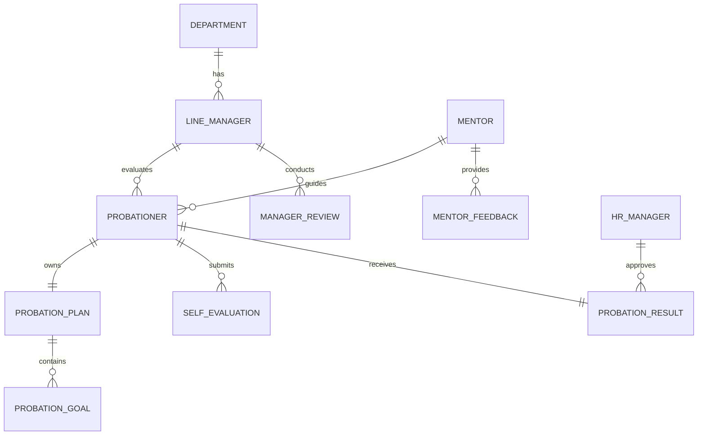

# Conceptual ERD — Probation Period Management System

## Mermaid Code

## Entity Description Table | Bang mo ta Entity

| # | Entity Name | Vietnamese Name | Description | Key Attributes | Main Relationships |
|---|-------------|-----------------|-------------|----------------|-------------------|
| 1 | DEPARTMENT | Phong ban | Don vi to chuc trong cong ty | department_id, name | has LINE_MANAGER |
| 2 | LINE_MANAGER | Quan ly truc tiep | Nguoi chiu trach nhiem danh gia | manager_id, name | evaluates PROBATIONER |
| 3 | MENTOR | Nguoi huong dan | Nguoi huong dan cong viec hang ngay | mentor_id, name | guides PROBATIONER |
| 4 | PROBATIONER | Nhan vien thu viec | Nhan vien moi dang trong ky thu viec | probationer_id, name, start_date | owns PROBATION_PLAN |
| 5 | PROBATION_PLAN | Ke hoach thu viec | Tong the ke hoach thu viec | plan_id, duration | contains PROBATION_GOAL |
| 6 | PROBATION_GOAL | Muc tieu thu viec | Cac KPI/Task cu unambiguous can dat | goal_id, description, target | belongs to PROBATION_PLAN |
| 7 | SELF_EVALUATION | Tu danh gia | Phieu tu danh gia cua nhan vien | evaluation_id, score, comments | belongs to PROBATIONER |
| 8 | MENTOR_FEEDBACK | Danh gia tu Mentor | Nhan xet tu nguoi huong dan | feedback_id, feedback_text | belongs to MENTOR |
| 9 | MANAGER_REVIEW | Danh gia cua Quan ly | Phieu danh gia cua Line Manager | review_id, summary_score | belongs to LINE_MANAGER |
| 10| PROBATION_RESULT | Ket qua thu viec | Ket qua xet duyet cuoi cung | result_id, final_status | receives from PROBATIONER |
| 11| HR_MANAGER | Quan ly nhan su | Nguoi kiem duyet cuoi cung | hr_id, name | approves PROBATION_RESULT |

## Relationship Description | Mo ta Quan he

| # | From Entity | Cardinality | To Entity | Relationship Label | Business Explanation |
|---|-------------|-------------|-----------|-------------------|----------------------|
| 1 | DEPARTMENT | one-to-many | LINE_MANAGER | has | Mot phong ban co nhieu quan ly. |
| 2 | LINE_MANAGER | one-to-many | PROBATIONER | evaluates | Mot quan ly co the danh gia nhieu nhan vien thu viec. |
| 3 | MENTOR | one-to-many | PROBATIONER | guides | Mot mentor co the huong dan nhieu nhan vien. |
| 4 | PROBATIONER | one-to-one | PROBATION_PLAN | owns | Moi nhan vien thu viec chi co mot ke hoach thu viec. |
| 5 | PROBATION_PLAN | one-to-many | PROBATION_GOAL | contains | Mot ke hoach thu viec gom nhieu muc tieu cu the. |
| 6 | PROBATIONER | one-to-many | SELF_EVALUATION | submits | Mot nhan vien co the nop nhieu ky tu danh gia (mid, final). |
| 7 | MENTOR | one-to-many | MENTOR_FEEDBACK | provides | Mentor gui cac phan hoi danh gia ve nhan vien. |
| 8 | LINE_MANAGER | one-to-many | MANAGER_REVIEW | conducts | Quan ly thuc hien cac ky danh gia cho nhan vien. |
| 9 | PROBATIONER | one-to-one | PROBATION_RESULT | receives | Moi nhan vien chi co mot ket qua thu viec cuoi cung. |
| 10| HR_MANAGER | one-to-many | PROBATION_RESULT | approves | Mot HR Manager co the phe duyet nhieu ket qua. |
