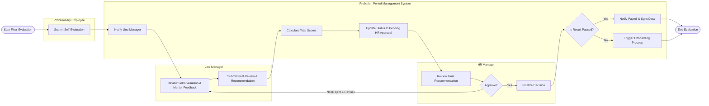

# Swimlane Diagram — Probation Period Management System

## Mermaid Code

## Flow Description | Mo ta luong

| Lane | Actor | Role in Flow |
|------|-------|-------------|
| 1 | Probationary Employee | Nguoi chu dong nop bang tu danh gia de bat dau quy trinh danh gia cuoi ky. |
| 2 | Line Manager | Tiep nhan cac danh gia, thuc hien danh gia cuoi cung va dua ra de xuat (Pass/Fail/Extend). |
| 3 | Probation Period Management System | He thong xu ly logic, tinh toan diem so, gui thong bao va dong bo du lieu cho he thong khac (Payroll). |
| 4 | HR Manager | Nguoi kiem duyet cuoi cung, xac nhan de xuat cua Line Manager de chot ket qua thu viec. |
