# Action Tree — Probation Period Management System

## Mermaid Code

```mermaid
%%{init: {'theme': 'default'}}%%
graph TD
    Root["Probation Period Management System"]

    Root --> M1["Probation Planning"]
    Root --> M2["Evaluation & Feedback"]
    Root --> M3["Result Decision"]
    Root --> M4["Integration & Reporting"]
    Root --> M5["System Administration"]

    M1 --> A11["Assign Mentor"]
    M1 --> A12["Set Probation Goals"]
    M1 --> A13["View Goal Progress"]
    M1 --> A14["Adjust Probation Plan"]

    M2 --> A21["Submit Self-Evaluation"]
    M2 --> A22["Submit Mentor Feedback"]
    M2 --> A23["Conduct Mid-Review"]
    M2 --> A24["Conduct Final Review"]

    M3 --> A31["Approve Probation Result"]
    M3 --> A32["Extend Probation Period"]
    M3 --> A33["Terminate Probation Contract"]

    M4 --> A41["Sync Hire Data"]
    M4 --> A42["Notify Payroll System"]
    M4 --> A43["Generate Performance Reports"]
    M4 --> A44["Export Result Data"]

    M5 --> A51["Manage Users & Roles"]
    M5 --> A52["Configure Notification Settings"]
    M5 --> A53["Manage Evaluation Templates"]
```

## Module Description | Mo ta Module

| # | Module | Description | Actions |
|---|--------|-------------|---------|
| 1 | Probation Planning | Thiet lap cac ke hoach va muc tieu thu viec | Assign Mentor, Set Probation Goals, View Goal Progress, Adjust Probation Plan |
| 2 | Evaluation & Feedback | Thuc hien viec danh gia qua trinh thu viec | Submit Self-Evaluation, Submit Mentor Feedback, Conduct Mid-Review, Conduct Final Review |
| 3 | Result Decision | Quyet dinh ket qua thu viec | Approve Probation Result, Extend Probation Period, Terminate Probation Contract |
| 4 | Integration & Reporting | Dong bo du lieu va bao cao thong ke | Sync Hire Data, Notify Payroll System, Generate Performance Reports, Export Result Data |
| 5 | System Administration | Quan tri va cau hinh he thong | Manage Users & Roles, Configure Notification Settings, Manage Evaluation Templates |
