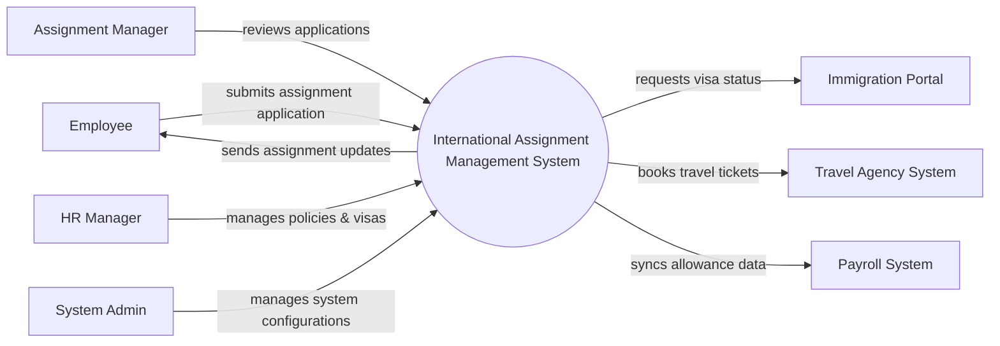

# Context Diagram — International Assignment Management System

## Mermaid Code

## Actor & Interaction Table | Bang Actor & Tuong tac

| # | Actor | Actor Type | Data Sent TO System | Data Received FROM System | Notes |
|---|-------|------------|---------------------|---------------------------|-------|
| 1 | Employee | Primary | Assignment applications, expense claims | Assignment status, notifications | Nhan vien di cong tac |
| 2 | Assignment Manager | Primary | Application approvals, feedback | Pending applications, reports | Quan ly xet duyet |
| 3 | HR Manager | Primary | Policies, visa tracking updates | Compliance alerts, reports | Quan ly nhan su |
| 4 | System Admin | Primary | User roles, system settings | Audit logs, system alerts | Quan tri he thong |
| 5 | Immigration Portal | Regulatory | Visa status updates | Visa application details | Cong thong tin xuat nhap canh |
| 6 | Travel Agency System | Supporting | Booking confirmations, itineraries | Booking requests | He thong dat ve may bay |
| 7 | Payroll System | Supporting | Processing status | Allowance and tax data | He thong tinh luong |

## System Boundary Description | Mo ta Pham vi He thong

The International Assignment Management System is designed to handle the end-to-end process of global employee deployments, including applications, approvals, and logistics tracking. It serves as a central hub for Employees, Managers, and HR to collaborate on assignment details. The system integrates with external platforms such as Travel Agency Systems for bookings and Payroll Systems for financial processing, but it does not process financial transactions internally.
