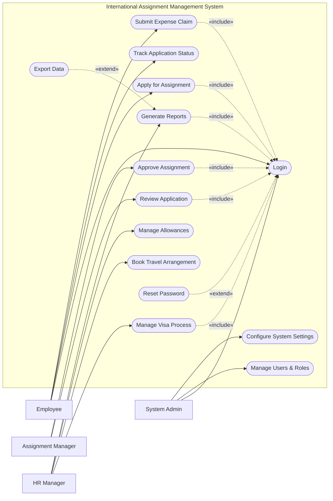

# Use Case Diagram — International Assignment Management System

## Mermaid Code

## Actor Table | Bang Actor

| # | Actor | Actor Type | Role Description | Related Use Cases |
|---|-------|------------|------------------|-------------------|
| 1 | Employee | Primary | Nhan vien thong thuong, nguoi tham gia assignment | UC01, UC02, UC03, UC04 |
| 2 | Assignment Manager | Primary | Quan ly truc tiep xem xet va duyet don | UC05, UC06 |
| 3 | HR Manager | Primary | Quan ly nhan su phu trach dieu phoi assignment | UC07, UC08, UC09, UC10 |
| 4 | System Admin | Primary | Quan tri he thong, phan quyen va cai dat | UC01, UC11, UC12 |

## Use Case Table | Bang Use Case

| # | UC ID | Use Case Name | Primary Actor | Secondary Actor | Description | Priority |
|---|-------|---------------|---------------|-----------------|-------------|----------|
| 1 | UC01 | Login | Employee | | Authenticate user access | High |
| 2 | UC02 | Apply for Assignment | Employee | | Submit request for international assignment | High |
| 3 | UC03 | Track Application Status| Employee | | View the status of submitted assignment | Medium |
| 4 | UC04 | Submit Expense Claim | Employee | | Submit expenses related to the assignment | High |
| 5 | UC05 | Review Application | Assignment Manager| | Review employee assignment details | High |
| 6 | UC06 | Approve Assignment | Assignment Manager| HR Manager | Approve or reject the assignment request | High |
| 7 | UC07 | Manage Visa Process | HR Manager | Immigration Portal | Handle visa applications and compliance | High |
| 8 | UC08 | Book Travel Arrangement | HR Manager | Travel Agency | Coordinate flights and accommodations | High |
| 9 | UC09 | Manage Allowances | HR Manager | Payroll System | Set up financial allowances for relocation | High |
| 10| UC10 | Generate Reports | HR Manager | | Create assignment and compliance reports | Medium |
| 11| UC11 | Manage Users & Roles | System Admin | | Administer system users | High |
| 12| UC12 | Configure System Settings| System Admin | | Configure global system parameters | Medium |
| 13| UC13 | Reset Password | Employee | | Recover user account access | High |
| 14| UC14 | Export Data | HR Manager | | Download reports in various formats | Low |

## Use Case Specification | Dac ta Use Case

---

### UC01 — Login

| Field | Detail |
|-------|--------|
| **UC ID** | UC01 |
| **Use Case Name** | Login |
| **Actor(s)** | Primary: Employee, Assignment Manager, HR Manager, System Admin |
| **Description** | Cho phep nguoi dung xac thuc de dang nhap vao he thong. |
| **Precondition** | 1. Nguoi dung phai co tai khoan hop le tren he thong.  2. He thong dang hoat dong. |
| **Main Flow** | 1. Actor mo trang dang nhap.  2. System hien thi form dang nhap.  3. Actor nhap username va password.  4. Actor nhan nut Submit.  5. System xac thuc thong tin.  6. System chuyen huong den trang chu tuong ung. |
| **Alternative Flow** | **AF1** — Quen mat khau: Neu Actor chon "Forgot Password", System kich hoat UC13 Reset Password. |
| **Exception Flow** | **EX1** — Sai thong tin: Neu xac thuc that bai, System bao loi va yeu cau nhap lai.  **EX2** — Tai khoan khoa: Nhap sai 5 lan, System khoa tai khoan. |
| **Postcondition** | Nguoi dung dang nhap thanh cong, phien lam viec bat dau. |
| **Business Rule** | **BR1**: Mat khau ma hoa chuan.  **BR2**: Tu dong dang xuat sau 30 phut khong hoat dong. |

---

### UC02 — Apply for Assignment

| Field | Detail |
|-------|--------|
| **UC ID** | UC02 |
| **Use Case Name** | Apply for Assignment |
| **Actor(s)** | Primary: Employee |
| **Description** | Cho phep nhan vien nop don xin dieu dong cong tac quoc te. |
| **Precondition** | 1. Nhan vien da dang nhap (Include UC01).  2. Nhan vien du dieu kien di cong tac. |
| **Main Flow** | 1. Actor chon "New Assignment Application".  2. System hien thi form dang ky.  3. Actor nhap quoc gia, thoi gian, va ly do cong tac.  4. Actor tai len tai lieu lien quan.  5. Actor nhan Submit.  6. System luu don va gui thong bao cho Manager. |
| **Alternative Flow** | **AF1** — Luu nhap: Actor chon "Save Draft" de luu vao ban nhap thay vi Submit. |
| **Exception Flow** | **EX1** — Thieu thong tin: Neu cac truong bat buoc bi trong, System bao loi. |
| **Postcondition** | Don luu trang thai "Pending Approval" va thong bao duoc gui. |
| **Business Rule** | **BR1**: Phai nop don truoc it nhat 30 ngay so voi ngay khoi hanh.  **BR2**: Thoi gian cong tac khong the la trong qua khu. |

---

### UC06 — Approve Assignment

| Field | Detail |
|-------|--------|
| **UC ID** | UC06 |
| **Use Case Name** | Approve Assignment |
| **Actor(s)** | Primary: Assignment Manager |
| **Description** | Quan ly xem xet va phe duyet don xin cong tac. |
| **Precondition** | 1. Manager da dang nhap (Include UC01).  2. Co don dang cho duyet. |
| **Main Flow** | 1. Actor mo danh sach don cho duyet.  2. System hien thi thong tin chi tiet don.  3. Actor chon "Approve".  4. System yeu cau xac nhan.  5. Actor xac nhan.  6. System chuyen trang thai sang "Approved" va thong bao cho HR. |
| **Alternative Flow** | **AF1** — Tu choi: Actor chon "Reject" va nhap ly do. System chuyen trang thai sang "Rejected". |
| **Exception Flow** | **EX1** — Don da xu ly: Neu don da bi huy boi nhan vien, System thong bao "Application no longer pending". |
| **Postcondition** | Trang thai don duoc cap nhat va chuyen den luong HR. |
| **Business Rule** | **BR1**: Chi quan ly truc tiep moi duoc quyen duyet don cua nhan vien. |

---

### UC07 — Manage Visa Process

| Field | Detail |
|-------|--------|
| **UC ID** | UC07 |
| **Use Case Name** | Manage Visa Process |
| **Actor(s)** | Primary: HR Manager |
| **Description** | HR Manager cap nhat va theo doi tien do xin visa cua nhan vien. |
| **Precondition** | 1. HR Manager da dang nhap (Include UC01).  2. Don cong tac da duoc phe duyet (Approved). |
| **Main Flow** | 1. Actor mo danh sach visa can xu ly.  2. System hien thi thong tin visa cua tung nhan vien.  3. Actor cap nhat trang thai thanh "Submitted to Embassy".  4. Actor tai len ban sao ho so neu can.  5. System luu trang thai va thong bao den nhan vien. |
| **Alternative Flow** | **AF1** — Visa duoc cap: Actor cap nhat trang thai "Visa Approved" va nhap ngay het han. |
| **Exception Flow** | **EX1** — Truot visa: Actor cap nhat "Visa Rejected", System canh bao de dung quy trinh cong tac. |
| **Postcondition** | Trang thai visa duoc dong bo voi he thong va thong bao duoc gui. |
| **Business Rule** | **BR1**: Chuyen bay chi duoc phep dat sau khi visa da o trang thai "Approved". |
