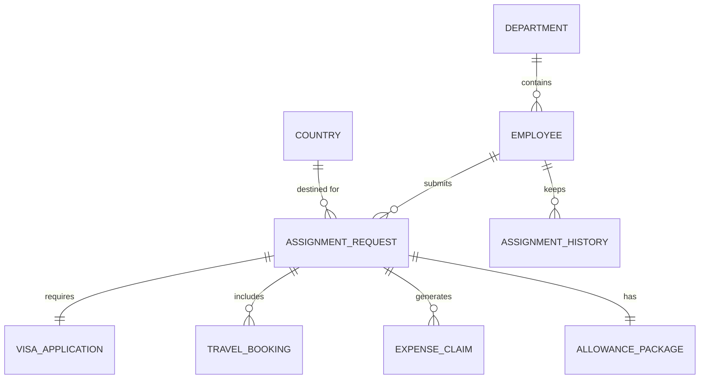

# Conceptual ERD — International Assignment Management System

## Mermaid Code

## Entity Description Table | Bang mo ta Entity

| # | Entity Name | Vietnamese Name | Description | Key Attributes | Main Relationships |
|---|-------------|-----------------|-------------|----------------|-------------------|
| 1 | DEPARTMENT | Phong ban | Thong tin phong ban quan ly nhan vien | department_id, name | contains EMPLOYEE |
| 2 | EMPLOYEE | Nhan vien | Ho so ca nhan cua nhan vien di cong tac | employee_id, name, email | submits ASSIGNMENT_REQUEST |
| 3 | COUNTRY | Quoc gia | Thong tin quoc gia den cong tac | country_id, name, code | destined for ASSIGNMENT_REQUEST |
| 4 | ASSIGNMENT_REQUEST | Don cong tac | Yeu cau dieu dong cong tac quoc te | request_id, start_date, status | requires VISA_APPLICATION |
| 5 | VISA_APPLICATION | Ho so Visa | Thong tin xin cap visa cua nhan vien | visa_id, type, status | belongs to ASSIGNMENT_REQUEST |
| 6 | TRAVEL_BOOKING | Dat cho di lai | Thong tin ve may bay va khach san | booking_id, flight_no, hotel | belongs to ASSIGNMENT_REQUEST |
| 7 | EXPENSE_CLAIM | Phieu thanh toan | Cac khoan chi phi nhan vien yeu cau hoan tra | claim_id, amount, status | belongs to ASSIGNMENT_REQUEST |
| 8 | ALLOWANCE_PACKAGE | Goi phu cap | Thong tin phu cap ho tro nhan vien | package_id, total_value | belongs to ASSIGNMENT_REQUEST |
| 9 | ASSIGNMENT_HISTORY | Lich su cong tac | Lich su cac lan di cong tac cua nhan vien | history_id, duration | belongs to EMPLOYEE |

## Relationship Description | Mo ta Quan he

| # | From Entity | Cardinality | To Entity | Relationship Label | Business Explanation |
|---|-------------|-------------|-----------|-------------------|----------------------|
| 1 | DEPARTMENT | one-to-many | EMPLOYEE | contains | Mot phong ban bao gom nhieu nhan vien. |
| 2 | COUNTRY | one-to-many | ASSIGNMENT_REQUEST | destined for | Mot quoc gia co the la diem den cua nhieu don cong tac. |
| 3 | EMPLOYEE | one-to-many | ASSIGNMENT_REQUEST | submits | Mot nhan vien co the nop nhieu don cong tac. |
| 4 | ASSIGNMENT_REQUEST | one-to-one | VISA_APPLICATION | requires | Moi don cong tac yeu cau mot ho so xin visa. |
| 5 | ASSIGNMENT_REQUEST | one-to-many | TRAVEL_BOOKING | includes | Mot don cong tac bao gom nhieu dat cho di lai, khach san. |
| 6 | ASSIGNMENT_REQUEST | one-to-many | EXPENSE_CLAIM | generates | Mot don cong tac phat sinh nhieu khoan yeu cau thanh toan. |
| 7 | ASSIGNMENT_REQUEST | one-to-one | ALLOWANCE_PACKAGE | has | Mot don cong tac di kem mot goi phu cap cu thu. |
| 8 | EMPLOYEE | one-to-many | ASSIGNMENT_HISTORY | keeps | Moi nhan vien luu giu nhieu ban ghi lich su cong tac. |
