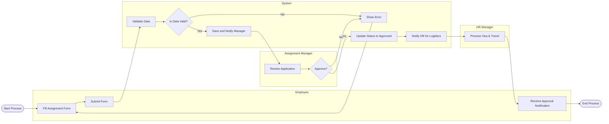

# Swimlane Diagram — International Assignment Management System

## Mermaid Code

## Flow Description | Mo ta luong

| Lane | Actor | Role in Flow |
|------|-------|-------------|
| 1 | Employee | Nguoi khoi tao don xin cong tac va nhan thong bao cuoi cung. |
| 2 | System | Kiem tra tinh hop le, cap nhat trang thai va gui cac canh bao, thong bao cho cac ben lien quan. |
| 3 | Assignment Manager | Nguoi quan ly danh gia va ra quyet dinh duyet don. |
| 4 | HR Manager | Nhan su phu trach cac thu tuc hau can (visa, ve may bay) sau khi don duoc duyet. |
