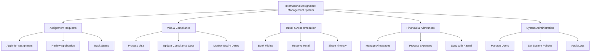

# Action Tree — International Assignment Management System

## Mermaid Code

## Module Description | Mo ta Module

| # | Module | Description | Actions |
|---|--------|-------------|---------|
| 1 | Assignment Requests | Quan ly viec xin va duyet don cong tac quoc te | Apply for Assignment, Review Application, Track Status |
| 2 | Visa & Compliance | Quan ly ho so visa va cac quy dinh so tai | Process Visa, Update Compliance Docs, Monitor Expiry Dates |
| 3 | Travel & Accommodation| Ho tro viec dat ve di lai va luu tru cho nhan vien | Book Flights, Reserve Hotel, Share Itinerary |
| 4 | Financial & Allowances | Quan ly cac chi phi phat sinh va phu cap | Manage Allowances, Process Expenses, Sync with Payroll |
| 5 | System Administration | Quan tri he thong va thiet lap nguoi dung | Manage Users, Set System Policies, Audit Logs |
