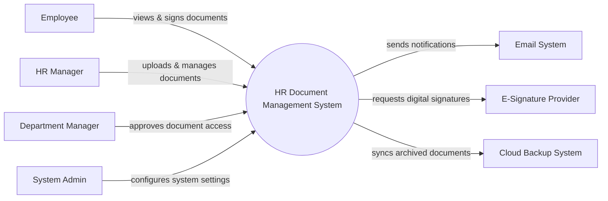

# Context Diagram — HR Document Management System

## Mermaid Code

## Actor & Interaction Table | Bang Actor & Tuong tac

| # | Actor | Actor Type | Data Sent TO System | Data Received FROM System | Notes |
|---|-------|------------|---------------------|---------------------------|-------|
| 1 | Employee | Primary | E-signature inputs, access requests | HR documents, policies | Nhan vien trong cong ty |
| 2 | HR Manager | Primary | Document files, templates, permissions | Audit reports, document statuses | Nhan su quan ly tai lieu |
| 3 | Department Manager | Primary | Access approvals | Document access alerts | Quan ly bo phan |
| 4 | System Admin | Primary | System configurations, user roles | System logs, audit reports | Quan tri he thong |
| 5 | Email System | Supporting | Email delivery statuses | Notification contents, recipients | He thong gui email |
| 6 | E-Signature Provider | Supporting | Digital signature certificates | Document hashes to sign | Dich vu chu ky so |
| 7 | Cloud Backup System | Supporting | Backup statuses | Archived document files | He thong luu tru dam may |

## System Boundary Description | Mo ta Pham vi He thong

The HR Document Management System is a centralized platform for storing, sharing, and tracking human resource documents. It handles the internal lifecycle of documents, from template creation and versioning to e-signature workflows and archiving. The system delegates actual email sending to an external Email System and relies on a third-party E-Signature Provider for legally binding signatures. It does not replace core HRMS functions like payroll or attendance, but focuses purely on document security and compliance.
