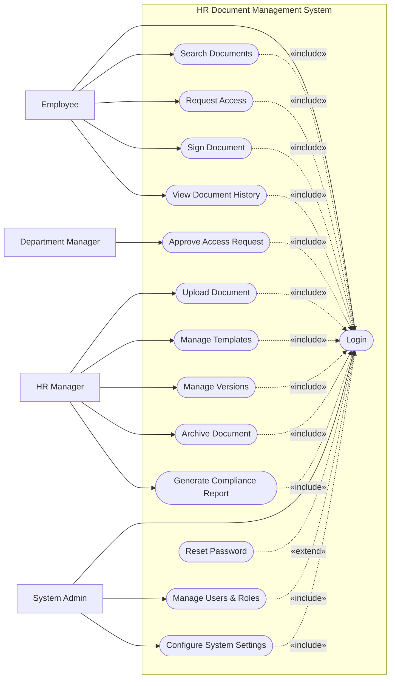

# Use Case Diagram — HR Document Management System

## Mermaid Code

## Actor Table | Bang Actor

| # | Actor | Actor Type | Role Description | Related Use Cases |
|---|-------|------------|------------------|-------------------|
| 1 | Employee | Primary | Nhan vien tieu thu tai lieu hoac ky ket ky dien tu | UC01, UC03, UC04, UC07, UC11 |
| 2 | Department Manager | Primary | Quan ly duyet quyen truy cap cho nhan vien thuoc bo phan | UC05 |
| 3 | HR Manager | Primary | Nhan su so huu va quan ly kho tai lieu, bieu mau | UC02, UC06, UC08, UC09, UC10 |
| 4 | System Admin | Primary | Quan tri vien he thong, phan quyen va cai dat | UC01, UC12, UC13 |

## Use Case Table | Bang Use Case

| # | UC ID | Use Case Name | Primary Actor | Secondary Actor | Description | Priority |
|---|-------|---------------|---------------|-----------------|-------------|----------|
| 1 | UC01 | Login | Employee | | Authenticate user access | High |
| 2 | UC02 | Upload Document | HR Manager | | Upload new HR documents to the system | High |
| 3 | UC03 | Search Documents | Employee | | Browse and search for permitted documents | High |
| 4 | UC04 | Request Access | Employee | | Request permission to view restricted documents | Medium |
| 5 | UC05 | Approve Access Request | Department Manager | | Review and approve document access | High |
| 6 | UC06 | Manage Templates | HR Manager | | Create and update standardized document templates | Medium |
| 7 | UC07 | Sign Document | Employee | E-Signature Provider | Electronically sign HR documents | High |
| 8 | UC08 | Manage Versions | HR Manager | | Track and manage different versions of a document | Medium |
| 9 | UC09 | Archive Document | HR Manager | Cloud Backup System | Move old documents to secure archive | Low |
| 10| UC10 | Generate Compliance Report | HR Manager | | Generate reports on document statuses and signatures | Medium |
| 11| UC11 | View Document History | Employee | | View audit trail and history of a document | Low |
| 12| UC12 | Manage Users & Roles | System Admin | | Configure user accounts and RBAC | High |
| 13| UC13 | Configure System Settings | System Admin | | Adjust system-wide configurations | Medium |
| 14| UC14 | Reset Password | Employee | Email System | Recover account access via email | High |

## Use Case Specification | Dac ta Use Case

---

### UC01 — Login

| Field | Detail |
|-------|--------|
| **UC ID** | UC01 |
| **Use Case Name** | Login |
| **Actor(s)** | Primary: Employee, HR Manager, Department Manager, System Admin |
| **Description** | Cho phep nguoi dung xac thuc de dang nhap vao he thong. |
| **Precondition** | 1. Nguoi dung phai co tai khoan hop le tren he thong.  2. He thong dang hoat dong binh thuong. |
| **Main Flow** | 1. Actor mo trang dang nhap.  2. System hien thi form dang nhap.  3. Actor nhap username va password.  4. Actor nhan nut Submit.  5. System xac thuc thong tin.  6. System chuyen huong den trang chu tuong ung quyen han. |
| **Alternative Flow** | **AF1** — Quen mat khau: Neu Actor chon "Forgot Password", System kich hoat UC14 Reset Password. |
| **Exception Flow** | **EX1** — Sai thong tin: Neu xac thuc that bai, System hien thi thong bao loi va yeu cau nhap lai.  **EX2** — Tai khoan bi khoa: Neu nhap sai qua 5 lan, System khoa tai khoan va thong bao lien he Admin. |
| **Postcondition** | Nguoi dung duoc dang nhap va phien lam viec duoc khoi tao. |
| **Business Rule** | **BR1**: Mat khau phai duoc ma hoa.  **BR2**: Phien dang nhap tu dong het han sau 30 phut khong hoat dong. |

---

### UC02 — Upload Document

| Field | Detail |
|-------|--------|
| **UC ID** | UC02 |
| **Use Case Name** | Upload Document |
| **Actor(s)** | Primary: HR Manager |
| **Description** | Cho phep HR Manager tai len tai lieu moi vao he thong. |
| **Precondition** | 1. HR Manager da dang nhap (Include UC01).  2. Tai lieu co dung luong phu hop va dinh dang hop le. |
| **Main Flow** | 1. Actor chon "Upload Document".  2. System hien thi form tai len.  3. Actor chon file, nhap ten tai lieu, chon danh muc, va phan quyen truy cap.  4. Actor nhan "Upload".  5. System quet virus file.  6. System luu tru file va cap nhat co so du lieu.  7. System hien thi thong bao thanh cong. |
| **Alternative Flow** | **AF1** — Huy bo: Truoc khi nhan Upload, Actor chon "Cancel" de huy qua trinh. |
| **Exception Flow** | **EX1** — File khong hop le: Neu file sai dinh dang hoac qua dung luong, System bao loi.  **EX2** — Phat hien virus: System chan tai len neu file co ma doc. |
| **Postcondition** | Tai lieu moi duoc luu va co the truy cap theo phan quyen. |
| **Business Rule** | **BR1**: Dung luong file khong vuot qua 20MB.  **BR2**: Chi ho tro dinh dang PDF, DOCX. |

---

### UC04 — Request Access

| Field | Detail |
|-------|--------|
| **UC ID** | UC04 |
| **Use Case Name** | Request Access |
| **Actor(s)** | Primary: Employee |
| **Description** | Nhan vien yeu cau cap quyen de xem mot tai lieu ma ho chua co quyen. |
| **Precondition** | 1. Nhan vien da dang nhap (Include UC01).  2. Nhan vien tim thay tai lieu nhung khong co quyen xem. |
| **Main Flow** | 1. Actor chon tai lieu bi khoa va nhan "Request Access".  2. System hien thi popup nhap ly do yeu cau.  3. Actor nhap ly do va Submit.  4. System ghi nhan yeu cau voi trang thai "Pending".  5. System gui thong bao cho Department Manager. |
| **Alternative Flow** | **AF1** — Huy yeu cau: Actor nhan "Cancel" o buoc 2 de dong popup. |
| **Exception Flow** | **EX1** — Da yeu cau: Neu yeu cau truoc do van dang Pending, System thong bao va khong cho gui tiep. |
| **Postcondition** | Yeu cau truy cap duoc luu va cho phe duyet. |
| **Business Rule** | **BR1**: Yeu cau phai co ly do cu specific.  **BR2**: Yeu cau chi duoc gui toi quan ly truc tiep hoac HR Manager. |

---

### UC05 — Approve Access Request

| Field | Detail |
|-------|--------|
| **UC ID** | UC05 |
| **Use Case Name** | Approve Access Request |
| **Actor(s)** | Primary: Department Manager |
| **Description** | Quan ly xem xet va phe duyet/tu choi yeu cau truy cap tai lieu. |
| **Precondition** | 1. Manager da dang nhap (Include UC01).  2. Co yeu cau truy cap dang cho. |
| **Main Flow** | 1. Actor vao man hinh "Access Requests".  2. System hien thi danh sach yeu cau dang Pending.  3. Actor chon xem mot yeu cau.  4. Actor nhan "Approve".  5. System cap nhat quyen truy cap cho nhan vien doi voi tai lieu do.  6. System gui thong bao den nhan vien. |
| **Alternative Flow** | **AF1** — Tu choi: O buoc 4, Actor nhan "Reject" va nhap ly do. System tu choi va gui thong bao. |
| **Exception Flow** | **EX1** — Yeu cau khong ton tai: Neu yeu cau da bi nguoi khac xu ly, System bao loi "Request already processed". |
| **Postcondition** | Yeu cau duoc phe duyet, nhan vien co the xem tai lieu, hoac bi tu choi. |
| **Business Rule** | **BR1**: Quyen truy cap duoc cap mac dinh trong 7 ngay hoac theo thoi han tuy chinh. |

---

### UC07 — Sign Document

| Field | Detail |
|-------|--------|
| **UC ID** | UC07 |
| **Use Case Name** | Sign Document |
| **Actor(s)** | Primary: Employee / Secondary: E-Signature Provider |
| **Description** | Nhan vien thuc hien ky dien tu xac nhan tai lieu (VD: Hop dong). |
| **Precondition** | 1. Nhan vien da dang nhap (Include UC01).  2. Tai lieu dang o trang thai "Awaiting Signature". |
| **Main Flow** | 1. Actor mo tai lieu can ky.  2. Actor chon "Sign Document".  3. System goi API den E-Signature Provider de khoi tao phien ky.  4. Actor thuc hien thao tac ky (ve, nhap ten, hoac su dung chung thu).  5. E-Signature Provider tra ve ket qua xac nhan chu ky.  6. System cap nhat trang thai tai lieu thanh "Signed" va luu phien ban moi. |
| **Alternative Flow** | **AF1** — Tu choi ky: Actor chon "Decline to Sign" va nhap ly do. System doi trang thai thanh "Declined". |
| **Exception Flow** | **EX1** — Loi API: Neu E-Signature Provider khong phan hoi, System bao loi "Signature service unavailable" va yeu cau thu lai sau. |
| **Postcondition** | Tai lieu duoc xac nhan ky va co the tra cuu lich su. |
| **Business Rule** | **BR1**: Chu ky so phai tuan thu tieu chuan phap ly hien hanh.  **BR2**: Sau khi ky, tai lieu tro thanh Read-only. |
