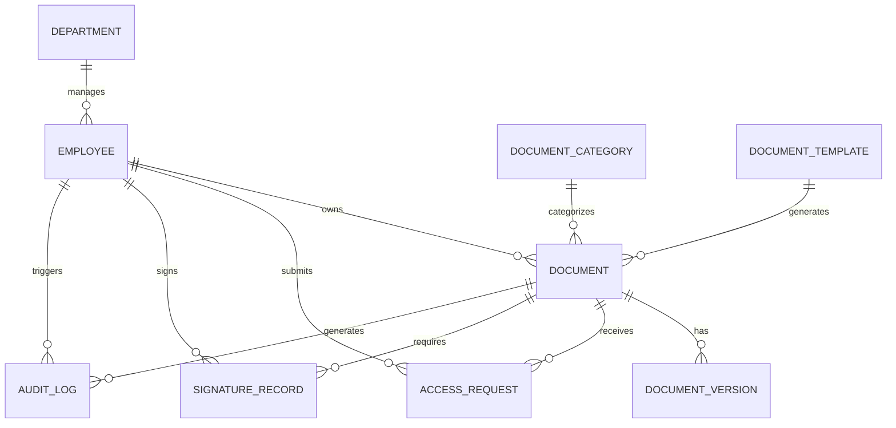

# Conceptual ERD — HR Document Management System

## Mermaid Code

## Entity Description Table | Bang mo ta Entity

| # | Entity Name | Vietnamese Name | Description | Key Attributes | Main Relationships |
|---|-------------|-----------------|-------------|----------------|-------------------|
| 1 | DEPARTMENT | Phong ban | Thong tin cac phong ban | department_id, name | manages EMPLOYEE |
| 2 | EMPLOYEE | Nhan vien | Ho so nguoi dung | employee_id, name, role | owns DOCUMENT, submits ACCESS_REQUEST |
| 3 | DOCUMENT_CATEGORY| Danh muc tai lieu | Loai tai lieu (Quy trinh, Hop dong...) | category_id, name, description | categorizes DOCUMENT |
| 4 | DOCUMENT_TEMPLATE| Bieu mau tai lieu | Cac bieu mau chuan de tao tai lieu | template_id, name, file_path | generates DOCUMENT |
| 5 | DOCUMENT | Tai lieu | Thong tin chinh cua tai lieu | document_id, title, status | has DOCUMENT_VERSION |
| 6 | DOCUMENT_VERSION | Phien ban tai lieu| Cac phien ban lich su cua tai lieu | version_id, version_num, file_path | belongs to DOCUMENT |
| 7 | ACCESS_REQUEST | Yeu cau truy cap | Yeu cau xem tai lieu | request_id, status, reason | belongs to EMPLOYEE, DOCUMENT |
| 8 | SIGNATURE_RECORD | Lich su chu ky | Thong tin ky dien tu | signature_id, signed_at, hash | belongs to EMPLOYEE, DOCUMENT |
| 9 | AUDIT_LOG | Nhat ky he thong | Luu vet thao tac he thong | log_id, action, timestamp | belongs to EMPLOYEE, DOCUMENT |

## Relationship Description | Mo ta Quan he

| # | From Entity | Cardinality | To Entity | Relationship Label | Business Explanation |
|---|-------------|-------------|-----------|-------------------|----------------------|
| 1 | DEPARTMENT | one-to-many | EMPLOYEE | manages | Mot phong ban quan ly nhieu nhan vien. |
| 2 | EMPLOYEE | one-to-many | DOCUMENT | owns | Mot nhan vien co the so huu (tao) nhieu tai lieu. |
| 3 | DOCUMENT_CATEGORY| one-to-many | DOCUMENT | categorizes | Mot danh muc chua nhieu tai lieu. |
| 4 | DOCUMENT_TEMPLATE| one-to-many | DOCUMENT | generates | Mot bieu mau dung de tao ra nhieu tai lieu. |
| 5 | DOCUMENT | one-to-many | DOCUMENT_VERSION| has | Mot tai lieu co the co nhieu phien ban. |
| 6 | EMPLOYEE | one-to-many | ACCESS_REQUEST | submits | Mot nhan vien co the tao nhieu yeu cau truy cap. |
| 7 | DOCUMENT | one-to-many | ACCESS_REQUEST | receives | Mot tai lieu co the nhan nhieu yeu cau truy cap. |
| 8 | EMPLOYEE | one-to-many | SIGNATURE_RECORD | signs | Mot nhan vien co the ky tren nhieu tai lieu. |
| 9 | DOCUMENT | one-to-many | SIGNATURE_RECORD | requires | Mot tai lieu co the can nhieu nguoi ky. |
| 10| EMPLOYEE | one-to-many | AUDIT_LOG | triggers | Mot thao tac cua nhan vien sinh ra nhieu log. |
| 11| DOCUMENT | one-to-many | AUDIT_LOG | generates | Su kien tren tai lieu sinh ra nhieu log. |
