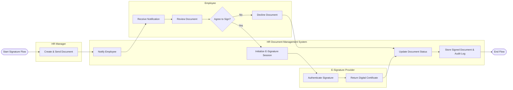

# Swimlane Diagram — HR Document Management System

## Mermaid Code

## Flow Description | Mo ta luong

| Lane | Actor | Role in Flow |
|------|-------|-------------|
| 1 | HR Manager | Nguoi soan thao tai lieu hoac hop dong va khoi tao quy trinh yeu cau chu ky. |
| 2 | HR Document Management System | He thong dieu phoi luong, thong bao, luu tru lich su va cap nhat trang thai tai lieu. |
| 3 | Employee | Nguoi nhan yeu cau, xem xet noi dung va quyet dinh ky hoac tu choi tai lieu. |
| 4 | E-Signature Provider | Doi tac thu ba (API) cung cap chung thu so va xac thuc chu ky dien tu hop phap. |
