# Action Tree — HR Document Management System

## Mermaid Code

```mermaid
%%{init: {'theme': 'default'}}%%
graph TD
    Root["HR Document Management System"]

    Root --> M1["User Management"]
    Root --> M2["Document Repository"]
    Root --> M3["Template Management"]
    Root --> M4["Workflow & Approval"]
    Root --> M5["E-Signature & Compliance"]

    M1 --> A11["Manage Roles & Permissions"]
    M1 --> A12["Manage User Accounts"]
    M1 --> A13["Configure System Settings"]

    M2 --> A21["Upload Document"]
    M2 --> A22["Browse & Search Documents"]
    M2 --> A23["Manage Document Versions"]
    M2 --> A24["Archive Document"]

    M3 --> A31["Create Template"]
    M3 --> A32["Update Template"]
    M3 --> A33["Generate Document from Template"]

    M4 --> A41["Request Access"]
    M4 --> A42["Approve/Reject Access"]
    M4 --> A43["Track Document Workflow"]

    M5 --> A51["Request E-Signature"]
    M5 --> A52["Sign Document"]
    M5 --> A53["View Audit Logs"]
    M5 --> A54["Generate Compliance Report"]
```

## Module Description | Mo ta Module

| # | Module | Description | Actions |
|---|--------|-------------|---------|
| 1 | User Management | Quan ly nguoi dung, phan quyen va thiet lap he thong | Manage Roles & Permissions, Manage User Accounts, Configure System Settings |
| 2 | Document Repository | Kho luu tru trung tam quan ly vong doi tai lieu | Upload Document, Browse & Search Documents, Manage Document Versions, Archive Document |
| 3 | Template Management | Quan ly cac bieu mau chuan de soan thao nhanh tai lieu | Create Template, Update Template, Generate Document from Template |
| 4 | Workflow & Approval | Xu ly cac yeu cau truy cap, phe duyet luong cong viec | Request Access, Approve/Reject Access, Track Document Workflow |
| 5 | E-Signature & Compliance | Giai quyet viec ky ket dien tu va kiem toan he thong | Request E-Signature, Sign Document, View Audit Logs, Generate Compliance Report |
