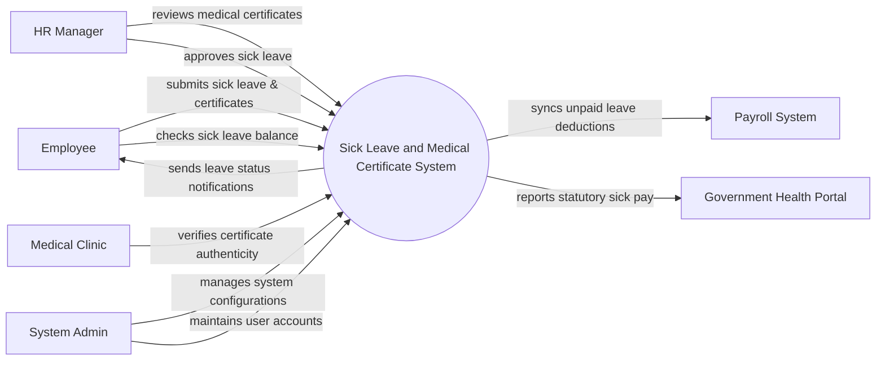

# Context Diagram — Sick Leave and Medical Certificate System

## Mermaid Code

## Actor & Interaction Table | Bang Actor & Tuong tac

| # | Actor | Actor Type | Data Sent TO System | Data Received FROM System | Notes |
|---|-------|------------|---------------------|---------------------------|-------|
| 1 | Employee | Primary | Sick leave requests, digital medical certificates | Leave status notifications, balance updates | Nhan vien xin nghi om |
| 2 | HR Manager | Primary | Certificate verification statuses, approval decisions | Pending leave requests, certificate documents | Quan ly nhan su |
| 3 | Medical Clinic | Supporting | Certificate validity confirmation | Verification requests | Phong kham/Benh vien |
| 4 | Payroll System | Supporting | Payroll sync confirmation | Unpaid leave days, deduction amounts | He thong tinh luong |
| 5 | Government Health Portal | Regulatory | Statutory sick pay guidelines | Statutory sick leave reports | Cong y te chinh phu |
| 6 | System Admin | Primary | System configurations, user roles | System logs, audit reports | Quan tri he thong |

## System Boundary Description | Mo ta Pham vi He thong

The Sick Leave and Medical Certificate System handles the end-to-end process of employees applying for sick leave and submitting medical certificates. It facilitates the review and verification of these certificates by HR Managers, sometimes cross-checking with external Medical Clinics. The system does not directly process payroll or government health benefits; it integrates with Payroll Systems and Government Health Portals to transmit necessary deduction and statutory reporting data.
