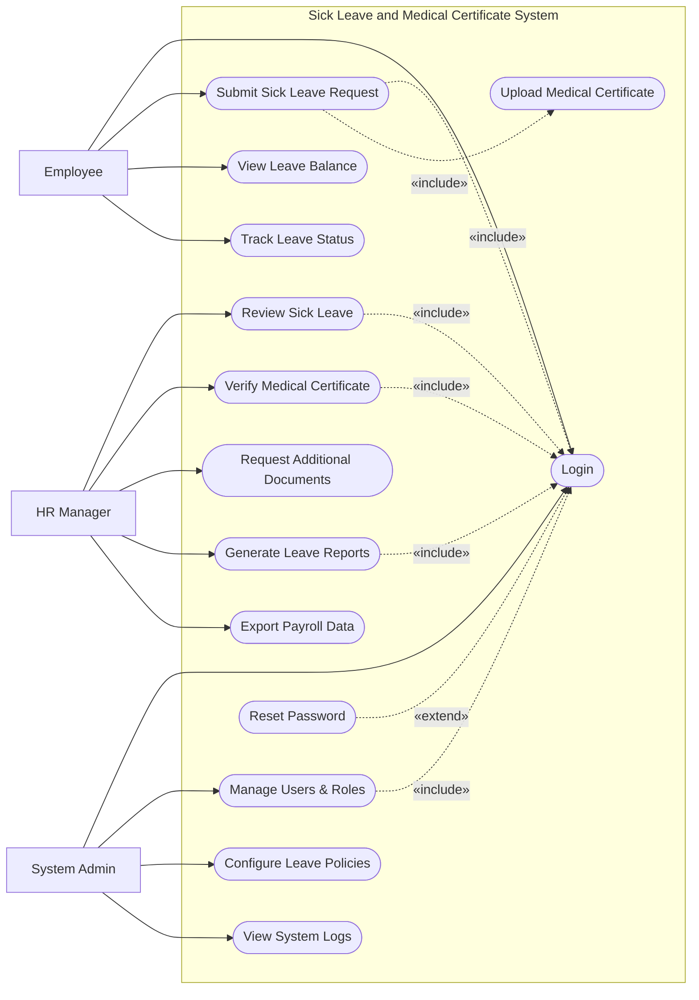

# Use Case Diagram — Sick Leave and Medical Certificate System

## Mermaid Code

## Actor Table | Bang Actor

| # | Actor | Actor Type | Role Description | Related Use Cases |
|---|-------|------------|------------------|-------------------|
| 1 | Employee | Primary | Nhan vien cong ty co nhu cau xin nghi om | UC01, UC02, UC04, UC05, UC13 |
| 2 | HR Manager | Primary | Nhan su kiem tra va xac thuc giay kham benh, duyet nghi om | UC06, UC07, UC08, UC09, UC10 |
| 3 | System Admin | Primary | Quan tri vien he thong, phan quyen va thiet lap chinh sach | UC01, UC11, UC12, UC14 |

## Use Case Table | Bang Use Case

| # | UC ID | Use Case Name | Primary Actor | Secondary Actor | Description | Priority |
|---|-------|---------------|---------------|-----------------|-------------|----------|
| 1 | UC01 | Login | Employee | | Authenticate user access | High |
| 2 | UC02 | Submit Sick Leave Request | Employee | | Submit a request for sick leave | High |
| 3 | UC03 | Upload Medical Certificate | Employee | | Upload supporting medical documents | High |
| 4 | UC04 | View Leave Balance | Employee | | Check remaining sick leave days | Medium |
| 5 | UC05 | Track Leave Status | Employee | | View the approval status of leave requests | Low |
| 6 | UC06 | Review Sick Leave | HR Manager | | Review and process sick leave requests | High |
| 7 | UC07 | Verify Medical Certificate | HR Manager | | Check authenticity of uploaded certificates | High |
| 8 | UC08 | Request Additional Documents | HR Manager | | Ask employee for more medical proof | Medium |
| 9 | UC09 | Generate Leave Reports | HR Manager | | Create statistical sick leave reports | Medium |
| 10| UC10 | Export Payroll Data | HR Manager | | Export leave deductions for payroll | High |
| 11| UC11 | Manage Users & Roles | System Admin | | Create, update, or deactivate user accounts | High |
| 12| UC12 | Configure Leave Policies | System Admin | | Update sick leave quotas and rules | High |
| 13| UC13 | Reset Password | Employee | | Recover account access | Medium |
| 14| UC14 | View System Logs | System Admin | | Monitor system activities and errors | Low |

## Use Case Specification | Dac ta Use Case

---

### UC01 — Login

| Field | Detail |
|-------|--------|
| **UC ID** | UC01 |
| **Use Case Name** | Login |
| **Actor(s)** | Primary: Employee, HR Manager, System Admin |
| **Description** | Cho phep nguoi dung xac thuc de dang nhap vao he thong. |
| **Precondition** | 1. Nguoi dung phai co tai khoan hop le tren he thong.  2. He thong dang hoat dong binh thuong. |
| **Main Flow** | 1. Actor mo trang dang nhap.  2. System hien thi form dang nhap.  3. Actor nhap username va password.  4. Actor nhan nut Submit.  5. System xac thuc thong tin.  6. System chuyen huong den trang chu tuong ung quyen han. |
| **Alternative Flow** | **AF1** — Quen mat khau: Neu Actor chon "Forgot Password", System kich hoat UC13 Reset Password. |
| **Exception Flow** | **EX1** — Sai thong tin: Neu xac thuc that bai, System hien thi thong bao loi va yeu cau nhap lai.  **EX2** — Tai khoan bi khoa: Neu nhap sai qua 5 lan, System khoa tai khoan va thong bao lien he Admin. |
| **Postcondition** | Nguoi dung duoc dang nhap va phien lam viec duoc khoi tao. |
| **Business Rule** | **BR1**: Mat khau phai duoc ma hoa.  **BR2**: Phien dang nhap tu dong het han sau 30 phut khong hoat dong. |

---

### UC02 — Submit Sick Leave Request

| Field | Detail |
|-------|--------|
| **UC ID** | UC02 |
| **Use Case Name** | Submit Sick Leave Request |
| **Actor(s)** | Primary: Employee |
| **Description** | Cho phep nhan vien nop don xin nghi om va tai len giay chung nhan y te. |
| **Precondition** | 1. Nhan vien da dang nhap (Include UC01).  2. Nhan vien con quyen loi nghi om hoac duoc phep nghi khong luong. |
| **Main Flow** | 1. Actor chon chuc nang "Submit Sick Leave".  2. System hien thi form dang ky nghi om.  3. Actor chon ngay bat dau/ket thuc va nhap trieu chung/ly do.  4. System yeu cau tai len giay chung nhan y te (Include UC03).  5. Actor nhan Submit.  6. System luu don va gui thong bao den HR Manager. |
| **Alternative Flow** | **AF1** — Nghi om ngan han khong can giay: Neu so ngay nghi <= 2 (tuy chinh sach), System bo qua buoc 4 va cho phep Submit luon. |
| **Exception Flow** | **EX1** — Thieu giay to bat buoc: Neu nghi tren 2 ngay ma khong tai len giay y te, System bao loi va chan Submit.  **EX2** — Dinh dang file khong hop le: Neu file tai len khong phai PDF/JPG/PNG, System bao loi. |
| **Postcondition** | Don xin nghi om luu o trang thai "Pending Verification". |
| **Business Rule** | **BR1**: Nghi om lien tuc tu 3 ngay tro len bat buoc phai co giay chung nhan y te.  **BR2**: File upload khong duoc vuot qua 5MB. |

---

### UC06 — Review Sick Leave

| Field | Detail |
|-------|--------|
| **UC ID** | UC06 |
| **Use Case Name** | Review Sick Leave |
| **Actor(s)** | Primary: HR Manager |
| **Description** | HR Manager xem xet va phe duyet/tu choi don xin nghi om cua nhan vien. |
| **Precondition** | 1. HR Manager da dang nhap (Include UC01).  2. Co it nhat 1 don xin nghi om dang cho duyet. |
| **Main Flow** | 1. Actor truy cap man hinh "Sick Leave Reviews".  2. System hien thi danh sach don "Pending".  3. Actor chon mot don de xem chi tiet.  4. System hien thi thong tin don va lich su nghi om cua nhan vien.  5. Actor nhan "Approve".  6. System cap nhat trang thai don va gui thong bao den Employee. |
| **Alternative Flow** | **AF1** — Tu choi don: O buoc 5, Actor chon "Reject" va nhap ly do. System cap nhat trang thai "Rejected" va thong bao cho Employee. |
| **Exception Flow** | **EX1** — Don da xu ly: Neu don da bi huy hoac xu ly boi HR khac, System hien thi loi va lam moi danh sach. |
| **Postcondition** | Trang thai don chuyen sang "Approved" hoac "Rejected". |
| **Business Rule** | **BR1**: Neu don co giay chung nhan y te, phai hoan thanh UC07 Verify Medical Certificate truoc khi phe duyet. |

---

### UC07 — Verify Medical Certificate

| Field | Detail |
|-------|--------|
| **UC ID** | UC07 |
| **Use Case Name** | Verify Medical Certificate |
| **Actor(s)** | Primary: HR Manager |
| **Description** | HR Manager kiem tra tinh xac thuc cua giay chung nhan y te do nhan vien tai len. |
| **Precondition** | 1. HR Manager da dang nhap (Include UC01).  2. Nhan vien co tai len giay chung nhan y te kem theo don nghi om. |
| **Main Flow** | 1. Tu man hinh chi tiet don, Actor chon "View Certificate".  2. System hien thi tai lieu tren trinh xuyen tai lieu.  3. Actor kiem tra thong tin phong kham, chu ky, con dau.  4. Actor chon "Mark as Verified".  5. System danh dau giay to la hop le va mo khoa nut "Approve" cho don. |
| **Alternative Flow** | **AF1** — Yeu cau bo sung: Neu giay to mo/khong ro rang, Actor chon "Request Additional Info" (Kich hoat UC08). |
| **Exception Flow** | **EX1** — File bi loi: Neu he thong khong the doc duoc file, System thong bao loi va yeu cau HR lien he nhan vien. |
| **Postcondition** | Giay chung nhan duoc xac nhan hop le hoac bi tu choi/yeu cau bo sung. |
| **Business Rule** | **BR1**: Giay chung nhan phai co dau moc do hoac chu ky so hop le tu co so y te. |
