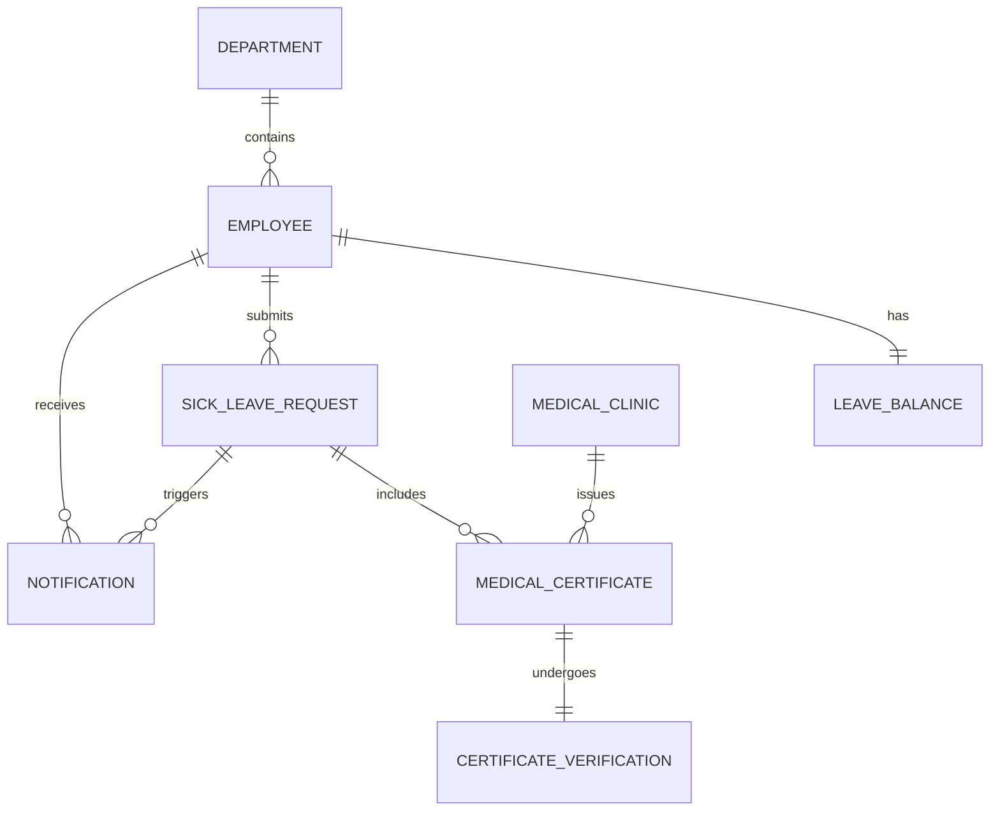

# Conceptual ERD — Sick Leave and Medical Certificate System

## Mermaid Code

## Entity Description Table | Bang mo ta Entity

| # | Entity Name | Vietnamese Name | Description | Key Attributes | Main Relationships |
|---|-------------|-----------------|-------------|----------------|-------------------|
| 1 | EMPLOYEE | Nhan vien | Ho so ca nhan cua nhan vien | employee_id, name, email | belongs to DEPARTMENT |
| 2 | LEAVE_BALANCE | Quy phep om | So ngay phep om con lai cua nhan vien | balance_id, sick_days | belongs to EMPLOYEE |
| 3 | SICK_LEAVE_REQUEST | Don xin nghi om | Yeu cau nghi om do nhan vien nop | request_id, start_date, status | submits MEDICAL_CERTIFICATE |
| 4 | MEDICAL_CERTIFICATE | Giay kham benh | Tai lieu minh chung y te | certificate_id, file_path | undergoes CERTIFICATE_VERIFICATION |
| 5 | CERTIFICATE_VERIFICATION| Phieu xac thuc | Ket qua kiem tra giay kham benh tu HR | verification_id, status, notes| belongs to MEDICAL_CERTIFICATE |
| 6 | MEDICAL_CLINIC | Phong kham | Thong tin co so y te cap giay | clinic_id, name, address | issues MEDICAL_CERTIFICATE |
| 7 | DEPARTMENT | Phong ban | Thong tin phong ban cua cong ty | department_id, name | contains EMPLOYEE |
| 8 | NOTIFICATION | Thong bao | Thong bao trang thai he thong | notification_id, message | belongs to EMPLOYEE |

## Relationship Description | Mo ta Quan he

| # | From Entity | Cardinality | To Entity | Relationship Label | Business Explanation |
|---|-------------|-------------|-----------|-------------------|----------------------|
| 1 | EMPLOYEE | one-to-one | LEAVE_BALANCE | has | Moi nhan vien co mot quy phep om trong nam. |
| 2 | EMPLOYEE | one-to-many | SICK_LEAVE_REQUEST | submits | Mot nhan vien co the nop nhieu don xin nghi om. |
| 3 | DEPARTMENT | one-to-many | EMPLOYEE | contains | Mot phong ban quan ly nhieu nhan vien. |
| 4 | SICK_LEAVE_REQUEST | one-to-many | MEDICAL_CERTIFICATE | includes | Mot don nghi om co the dinh kem nhieu giay y te. |
| 5 | MEDICAL_CERTIFICATE | one-to-one | CERTIFICATE_VERIFICATION | undergoes | Moi giay y te duoc xac thuc mot lan. |
| 6 | MEDICAL_CLINIC | one-to-many | MEDICAL_CERTIFICATE | issues | Mot phong kham co the cap nhieu giay kham benh. |
| 7 | SICK_LEAVE_REQUEST | one-to-many | NOTIFICATION | triggers | Mot don co the phat sinh nhieu thong bao. |
| 8 | EMPLOYEE | one-to-many | NOTIFICATION | receives | Mot nhan vien nhan nhieu thong bao tu he thong. |
